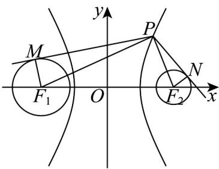

> [!faq]- 《专题3_2_双曲线_高效培优讲义_》官方解析
>
> > [!success]- **【答案】** B
>
> > [!note]- **【解析】**
> > 由双曲线方程 $\frac{x^2}{4} -\frac{y^2}{12} = 1$ 可知： $a = 2,b = 2\sqrt{3},c = \sqrt{a^2 + b^2} = 4$
> >
> > 可知双曲线方程的左、右焦点分别为 $F_{1}(-4,0)$ , $F_{2}(4,0)$
> >
> > 圆 $C_1:(x + 4)^2 +y^2 = 3$ 的圆心为 $C_1(-4,0)$ （即 $F_{1}$ ），半径为 $r_1 = \sqrt{3}$ ；
> > 圆 $C_2:(x - 4)^2 +y^2 = 1$ 的圆心为 $C_2(4,0)$ （即 $F_{2}$ ），半径为 $r_2 = 1$ 。
> >
> > 连接 $PF_{1}, PF_{2}, F_{1}M, F_{2}N$ ，则 $MF_{1} \perp PM, NF_{2} \perp PN$
> >
> > 
> >
> > 可得
> >
> > $$
> > \left(\stackrel {\sqcup \sqcup \sqcup} {P M} + \stackrel {\sqcup \sqcup \sqcup} {P N}\right) \cdot \stackrel {\sqcup \sqcup \sqcup} {N M} = \left(\stackrel {\sqcup \sqcup \sqcup} {P M} + \stackrel {\sqcup \sqcup \sqcup} {P N}\right) \cdot \left(\stackrel {\sqcup \sqcup \sqcup} {P M} - \stackrel {\sqcup \sqcup \sqcup} {P N}\right) = \left| \stackrel {\sqcup \sqcup \sqcup} {P M} \right| ^ {2} - \left| \stackrel {\sqcup \sqcup \sqcup} {P N} \right| ^ {2} = \left(\left| P F _ {1} \right| ^ {2} - r _ {1} ^ {2}\right) - \left(\left| P F _ {2} \right| ^ {2} - r _ {2} ^ {2}\right)
> > $$
> >
> > $$
> > = \left(\left| P F _ {1} \right| ^ {2} - 3\right) - \left(\left| P F _ {2} \right| ^ {2} - 1\right) = \left| P F _ {1} \right| ^ {2} - \left| P F _ {2} \right| ^ {2} - 2 = \left(\left| P F _ {1} \right| - \left| P F _ {2} \right|\right) \cdot \left(\left| P F _ {1} \right| + \left| P F _ {2} \right|\right) - 2
> > $$
> >
> > $$
> > = 2 a \left(\left| P F _ {1} \right| + \left| P F _ {2} \right|\right) - 2 \quad 2 a \cdot 2 c - 2 = 2 \times 2 \times 2 \times 4 - 2 = 3 0
> > $$
> >
> > 当且仅当 P 为双曲线的右顶点时，取得等号，即 $\left(\overline{PM} + \overline{PN}\right) \cdot \overline{NM}$ 的最小值为 30
> >
> > 故选 **B**.
