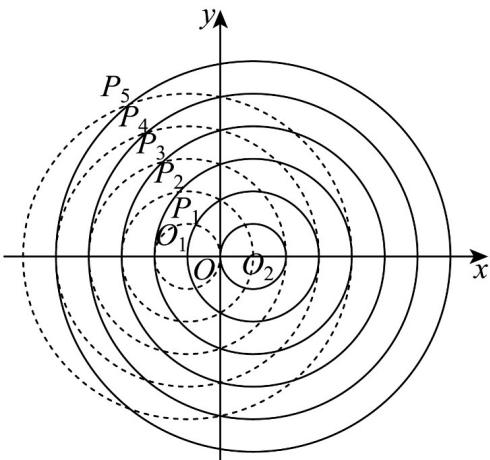

> [!faq]- 《专题3_2_双曲线_高效培优讲义_》官方解析
>
> > [!success]- **【答案】** C
>
> > [!note]- **【解析】**
> > 
> >
> > 因为圆 $A_{k}$ 以 $O_{1}(-1,0)$ 为圆心，正整数 k 为半径，圆 $B_{k+1}$ 以 $O_{2}(1,0)$ 为圆心，正整数 $k+1$ 为半径，
> >
> > 且点 $P_{k}(1 \leq k \leq 5)$ 是圆 $A_{k}$ 与圆 $B_{k+1}$ 的交点，
> >
> > 所以 $\left|P_kO_2\right| = k + 1$ ， $\left|P_kO_1\right| = k$
> >
> > 所以 $\left|P_{k}O_{2}\right|-\left|P_{k}O_{1}\right|=(k+1)-k=1$
> >
> > 由 $O_{1}(-1,0)$ ， $O_{2}(1,0)$ 可得 $\left|O_{1}O_{2}\right|=1-(-1)=2$
> >
> > 因为 $|P_kO_2| - |P_kO_1| = 1$ 为定值， $0 < 1 < 2 = |O_1O_2|$ ，且 $P_1, P_2, P_3, P_4, P_5$ 都位于第二象限，
> >
> > 所以根据双曲线的定义可知，点 $P_{1}$ 、 $P_{2}$ 、 $P_{3}$ 、 $P_{4}$ 、 $P_{5}$ 都位于双曲线的左支上
> >
> > 故选 **C**.
