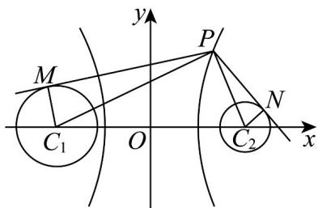

## 题型01 双曲线的定义

【典例1】过双曲线 $x^{2} - \frac{y^{2}}{8} = 1$ 的右支上一点 $P$ ，分别向圆 $C_1:(x + 3)^2 +y^2 = 2$ 和圆 $C_2:(x - 3)^2 +y^2 = 1$ 作切线，切点分别为 $M$ 、 $N$ ，则 $\left|PM\right|^2 -\left|PN\right|^2$ 的最小值为（）A.10 B.11 C.12 D.15

【答案】B

【详解】如图所示，双曲线方程 $x^{2} - \frac{y^{2}}{8} = 1$ 的两焦点坐标为 $C_1(-3,0)$ ， $C_2(3,0)$

连接 $PC_{1}$ ， $PC_{2}$ ， $MC_{1}$ ， $NC_{2}$ ，则 $\left|PC_1\right| - \left|PC_2\right| = 2$

因为 $MC_{1} \perp PM$ ， $NC_{2} \perp PN$

所以 $\left|PM\right|^{2}-\left|PN\right|^{2}=\left(\left|PC_{1}\right|^{2}-2\right)-\left(\left|PC_{2}\right|^{2}-1\right)$

$$
= \left(\left| P C _ {1} \right| - \left| P C _ {2} \right|\right) \left(\left| P C _ {1} \right| + \left| P C _ {2} \right|\right) - 1 = 2 \left(\left| P C _ {1} \right| + \left| P C _ {2} \right|\right) - 1 \quad 2 \times 6 - 1 = 1 1
$$

当且仅当 P 为双曲线右顶点时等号成立，

故选：B.

## 方法技巧

1、双曲线的定义中，常数 $2a$ 应当满足的约束条件： $\left\| PF_1\right| - \left|PF_2\right| = 2a < \left|F_1F_2\right|$ ，这可以借助于三角形中边的相

关性质“两边之差小于第三边”来理解；

2、若去掉定义中的“绝对值”，常数 $a$ 满足约束条件： $\left|PF_1\right| - \left|PF_2\right| = 2a < \left|F_1F_2\right|$ （ $a > 0$ ），则动点轨迹仅表示

双曲线中靠焦点 $F_{2}$ 的一支；若 $\left|PF_2\right| - \left|PF_1\right| = 2a < \left|F_1F_2\right|$ （ $a > 0$ ），则动点轨迹仅表示双曲线中靠焦点 $F_{1}$ 的一

支；

3、若常数 $a$ 满足约束条件： $\left\| PF_1\right| - \left|PF_2\right| = 2a = \left|F_1F_2\right|$ ，则动点轨迹是以 $F_{1}$ 、 $F_{2}$ 为端点的两条射线（包括端点）；

4、若常数 $a$ 满足约束条件： $\left|\left|PF_1\right| - \left|PF_2\right|\right| = 2a > \left|F_1F_2\right|$ ，则动点轨迹不存在；

5、若常数 $a = 0$ ，则动点轨迹为线段 $F_{1}F_{2}$ 的垂直平分线.

![[高中/课堂同步/题库/人教A版高中数学同步讲义(2026)/03_选择性必修第一册/第三章 圆锥曲线的方程/讲义/专题3_2_双曲线_高效培优讲义_/题型01_双曲线的定义_sec_15/questions/Q00063071.md]]
![[高中/课堂同步/题库/人教A版高中数学同步讲义(2026)/03_选择性必修第一册/第三章 圆锥曲线的方程/讲义/专题3_2_双曲线_高效培优讲义_/题型01_双曲线的定义_sec_15/questions/Q00063072.md]]
![[高中/课堂同步/题库/人教A版高中数学同步讲义(2026)/03_选择性必修第一册/第三章 圆锥曲线的方程/讲义/专题3_2_双曲线_高效培优讲义_/题型01_双曲线的定义_sec_15/questions/Q00063073.md]]
