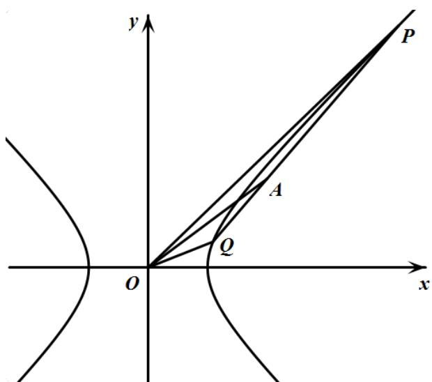

> [!faq]- 《专题3_2_双曲线_高效培优讲义_》官方解析
>
> > [!success]- **【答案】** (1) $x^{2}-y^{2}=1$ . (2) $\left(-\frac{7}{2},0\right)$ 和 $\left(0,\frac{7}{2}\right)$ 或 $\left(\frac{1}{2},0\right)$ 和 $\left(0,-\frac{1}{2}\right)$ (3) $y = \frac{22}{21} x - \frac{25}{42}$
>
> > [!note]- **【解析】**
> > （1）∵O,P,Q,A四点共线时， $\left|PQ\right|=\frac{10\sqrt{7}}{7}$ ，根据双曲线对称性，
> >
> > $\therefore P, Q$ 关于原点对称，不妨设 $P$ 在 $Q$ 在右侧，即 $P, Q$ 在圆 $x^{2} + y^{2} = \frac{25}{7}$
> >
> > 又 $A\left(2, \frac{3}{2}\right)$ ， $\therefore l_{OA}: y = \frac{3}{4} x$ ，与圆联立得 $P\left(\frac{4\sqrt{7}}{7}, \frac{3\sqrt{7}}{7}\right)$ ， $Q\left(-\frac{4\sqrt{7}}{7}, -\frac{3\sqrt{7}}{7}\right)$
> >
> > 代入 $\frac{x^2}{a^2} - y^2 = 1$ ， $\frac{16}{7a^2} - \frac{9}{7} = 1 \Rightarrow a^2 = 1$
> >
> > ∴双曲线 C 的标准方程为 $x^{2}-y^{2}=1$ .
> >
> > (2) $\because C: x^{2} - y^{2} = 1$ ， $\therefore$ 渐近线为 $y = x$ 或 $y = -x$
> >
> > ∵直线l与C的渐近线垂直，且经过点A，
> >
> > 当渐近线为 $y = x$ 时，直线 $l: x + y - \frac{7}{2} = 0$
> >
> > 与 $x$ 轴交点为 $\left(-\frac{7}{2},0\right)$ ， $y$ 轴交点为 $\left(0,\frac{7}{2}\right)$
> >
> > 当渐近线为 $y = -x$ 时，直线 $l: x - y - \frac{1}{2} = 0$
> >
> > 与 $x$ 轴交点为 $\left(\frac{1}{2},0\right)$ ， $y$ 轴交点为 $\left(0, -\frac{1}{2}\right)$
> >
> > 综上，直线 $l$ 与两坐标轴交点的坐标为 $\left(-\frac{7}{2},0\right)$ 和 $\left(0,\frac{7}{2}\right)$ 或 $\left(\frac{1}{2},0\right)$ 和 $\left(0, - \frac{1}{2}\right)$ .
> >
> > (3) 如图，
> >
> > 
> >
> > 根据题意直线 $PQ$ 斜率存在，设 $l_{PQ}:y = kx + m$ ， $P(x_1,y_1),Q(x_2,y_2)$
> >
> > 联立 $\left\{ \begin{array}{l} y = kx + m \\ x^2 - y^2 = 1 \end{array} \right. \Rightarrow \left(1 - k^2\right)x^2 - 2kmx - m^2 - 1 = 0$
> >
> > $$
> > x _ {1} + x _ {2} = \frac {2 k m}{1 - k ^ {2}} > 0, \quad x _ {1} x _ {2} = \frac {- m ^ {2} - 1}{1 - k ^ {2}} > 0
> > $$
> >
> > 解得 $k < -1$ 或 $k > 1$
> >
> > $$
> > y _ {1} y _ {2} = (k x _ {1} + m) (k x _ {2} + m) = k ^ {2} x _ {1} x _ {2} + k m (x _ {1} + x _ {2}) + m ^ {2} = \frac {m ^ {2} - k ^ {2}}{1 - k ^ {2}}
> > $$
> >
> > $$
> > x _ {1} y _ {2} + x _ {2} y _ {1} = 2 k x _ {1} x _ {2} + m \left(x _ {1} + x _ {2}\right) = \frac {- 2 k}{1 - k ^ {2}},
> > $$
> >
> > 设直线 $OP, OA, OQ$ 的倾斜角分别为 $\alpha, \theta, \beta$
> >
> > ∵OA 是 $\triangle OPQ$ 的角平分线，
> >
> > $\therefore \tan (\alpha +\beta) = \tan 2\theta = \frac{2\tan\theta}{1 - \tan^2\theta} = \frac{24}{7}$
> >
> > $$
> > \tan (\alpha + \beta) = \frac {\frac {y _ {1}}{x _ {1}} + \frac {y _ {2}}{x _ {2}}}{1 - \frac {y _ {1} y _ {2}}{x _ {1} x _ {2}}} = \frac {x _ {2} y _ {1} + x _ {1} y _ {2}}{x _ {1} x _ {2} - y _ {1} y _ {2}} = \frac {\frac {- 2 k}{1 - k ^ {2}}}{\frac {- 2 m ^ {2} - 1 + k ^ {2}}{1 - k ^ {2}}} = \frac {- 2 k}{- 2 m ^ {2} - 1 + k ^ {2}} = \frac {2 4}{7},
> > $$
> >
> > $$
> > 1 2 k ^ {2} + 7 k = 2 4 m ^ {2} + 1 2
> > $$
> >
> > 又点 $A\left(2, \frac{3}{2}\right)$ 在 $PQ$ 上，所以 $2k + m = \frac{3}{2}$
> >
> > 故 $12k^{2} + 7k = 24\left(\frac{3}{2} - 2k\right)^{2} + 12$
> >
> > 整理得 $84k^{2} - 151k + 66 = 0$ ，解得 $k = \frac{3}{4}$ 或 $k = \frac{22}{21}$
> >
> > 又 $k < -1$ 或 $k > 1$ ，所以 $k = \frac{22}{21}$
> >
> > 故直线 $PQ_{的方程为}$ $y=\frac{22}{21}x-\frac{25}{42}$
