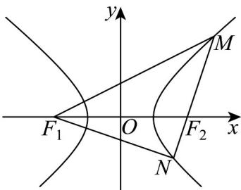

<!-- question-source:start -->
【变式1】如图，已知双曲线 $\frac{x^2}{a^2} -\frac{y^2}{b^2} = 1(a > 0,b > 0)$ 的实轴长为 $^4$ ，左、右焦点分别为 $F_{1}$ ， $F_{2}$ ，过 $F_{2}$ 的直线

$l$ 交双曲线的右支于点 $M,N$ ， $\left|MF_2\right| = 4$ ， $\angle F_{1}MF_{2} = \frac{\pi}{4}$ ，则 $\triangle F_{1}MN$ 的面积为（）

A. 16 B. $16\sqrt{2}$ C. 32 D. $32\sqrt{2}$
<!-- question-source:end -->

![[高中/课堂同步/题库/人教A版高中数学同步讲义(2026)/03_选择性必修第一册/第三章 圆锥曲线的方程/讲义/专题3_2_双曲线_高效培优讲义_/题型03_双曲线中焦点三角形的周长与面积及其他问题_sec_17/questions/answers/Q00063077A1.md]]
