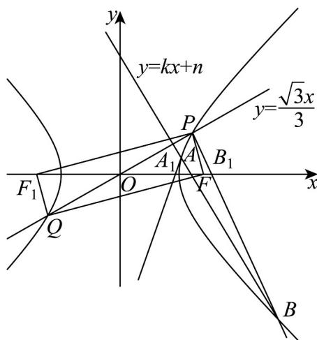

> [!faq]- 《专题3_2_双曲线_高效培优讲义_》官方解析
>
> > [!success]- **【答案】** (1) $\frac{x^{2}}{8}-\frac{y^{2}}{8}=1$ ， $\triangle PQF$ 的面积为8 (2) $-\sqrt{3}$
>
> > [!note]- **【解析】**
> > （1）由于 $l:y = \frac{\sqrt{3}}{3} x$ ，故 $\frac{\sqrt{3}}{3} = \tan \angle POF, \therefore \angle POF = 30^{\circ}$
> >
> > 又 $FP \perp FQ$ ，且 $P, Q$ 关于 $O$ 对称，所以 $|OP| = |OF| = |OQ| = c$ ，因此 $\angle PQF = 15^\circ$ ，
> >
> > 在 Rt△PQF 中， $\left|PF\right|=\left|PQ\right|\sin\angle PQF=2c\sin15^{\circ},\left|QF\right|=\left|PQ\right|\cos\angle PQF=2c\cos15^{\circ}$
> >
> > 取椭圆左焦点 $F_{1}$ ，连接 $PF_{1}, QF_{1}$ ，根据对称性可得 $\left|QF\right|=\left|PF_{1}\right|$
> >
> > 由椭圆定义可得 $\left|PF_{1}\right|-\left|PF\right|=\left|QF\right|-\left|PF\right|=2a$ ，即 $2c\cos15^{\circ}-2c\sin15^{\circ}=2a\Rightarrow2\sqrt{2}c\cos\left(15^{\circ}+45^{\circ}\right)=2a$
> >
> > 由于 $2c = 8$ ，所以 $a = 2\sqrt{2}$ ，进而可得 $b = 2\sqrt{2}$
> >
> > 故双曲线方程为 $C:\frac{x^{2}}{8}-\frac{y^{2}}{8}=1$
> >
> > $$
> > S _ {\triangle P Q F} = \frac {1}{2} | P F | | Q F | = \frac {1}{2} 2 c \sin 1 5 ^ {\circ} 2 c \cos 1 5 ^ {\circ} = c ^ {2} \sin 3 0 ^ {\circ} = 8
> > $$
> >
> > 
> >
> > (2) 设 $A(x_{1}, y_{1})$ , $B(x_{2}, y_{2})$ ,
> >
> > 由（1）知 $P\left(c\cos 30^{\circ},c\sin 30^{\circ}\right)$ 即 $P\left(2\sqrt{3},2\right),\therefore Q\left(-2\sqrt{3}, - 2\right)$
> >
> > 联立 $y = kx + n(k \neq 0)$ 与 $C: \frac{x^2}{8} - \frac{y^2}{8} = 1$ 的方程可得 $\left(1 - k^2\right)x^2 - 2knx - n^2 - 8 = 0$
> >
> > 则 $\Delta = 4k^{2}n^{2} - 4\left(1 - k^{2}\right)\left(-n^{2} - 8\right) = 4\left(n^{2} - 8k^{2} + 8\right) > 0$
> >
> > $$
> > x _ {1} + x _ {2} = \frac {2 k n}{1 - k ^ {2}}, x _ {1} x _ {2} = \frac {- n ^ {2} - 8}{1 - k ^ {2}}
> > $$
> >
> > 则直线 $AP$ 方程为 $y = \frac{y_1 - 2}{x_1 - 2\sqrt{3}} (x - 2\sqrt{3}) + 2$ ，令 $y = 0$ ，则 $x = \frac{2\sqrt{3}y_1 - 2x_1}{y_1 - 2}$ ，
> >
> > 故 $A_{1}\left(\frac{2\sqrt{3}y_{1}-2x_{1}}{y_{1}-2},0\right)$
> >
> > 同理可得 $B_{1}\left(\frac{2\sqrt{3}y_{2} - 2x_{2}}{y_{2} - 2},0\right),$
> >
> > 由于 $\left|PA_{1}\right|=\left|PB_{1}\right|$ ，所以P在线段 $A_{1}B_{1}$ 的垂直平分线上，故 $\frac{\frac{2\sqrt{3}y_{2}-2x_{2}}{y_{2}-2}+\frac{2\sqrt{3}y_{1}-2x_{1}}{y_{1}-2}}{2}=2\sqrt{3}$
> >
> > 故 $\frac{\left(2\sqrt{3}y_2 - 2x_2\right)\left(y_1 - 2\right) + \left(2\sqrt{3}y_1 - 2x_1\right)\left(y_2 - 2\right)}{\left(y_2 - 2\right)\left(y_1 - 2\right)} = 4\sqrt{3}$
> >
> > $$
> > \left(2 \sqrt {3} y _ {2} y _ {1} - 4 \sqrt {3} y _ {2} - 2 x _ {2} y _ {1} + 4 x _ {2}\right) + \left(2 \sqrt {3} y _ {2} y _ {1} - 4 \sqrt {3} y _ {1} - 2 x _ {1} y _ {2} + 4 x _ {1}\right) = 4 \sqrt {3} \left(y _ {2} y _ {1} - 2 y _ {1} - 2 y _ {2} + 4\right)
> > $$
> >
> > $$
> > - 2 x _ {2} \left(k x _ {1} + n\right) - 2 x _ {1} \left(k x _ {2} + n\right) + \left(4 x _ {1} + 4 x _ {2}\right) = 4 \sqrt {3} \left(- k x _ {1} - k x _ {2} - 2 n + 4\right)
> > $$
> >
> > 化简得 $-2kx_{1}x_{2}=(-2\sqrt{3}k+n-2)(x_{1}+x_{2})-4\sqrt{3}(n-2)$
> >
> > 代入韦达定理可得 $-2k\frac{-n^{2}-8}{1-k^{2}}=\left(-2\sqrt{3}k+n-2\right)\left(\frac{2kn}{1-k^{2}}\right)-4\sqrt{3}(n-2)$
> >
> > $$
> > \text {即} 2 \sqrt {3} k ^ {2} + (4 + n) k + \sqrt {3} n - 2 \sqrt {3} = 0, \text {故} (k + \sqrt {3}) (2 \sqrt {3} k + n - 2) = 0
> > $$
> >
> > 故 $k = -\sqrt{3}$ ，或 $2\sqrt{3}k + n - 2 = 0$ ，
> >
> > 若 $2\sqrt{3} k + n - 2 = 0$ ，此时直线 $AB$ 经过定点 $\left(2\sqrt{3},2\right)$ ，该点与 $P$ 重合，不满足题意，
> >
> > 故 $k = -\sqrt{3}$
