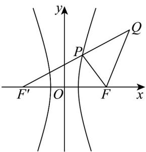

> [!faq]- 《专题3_2_双曲线_高效培优讲义_》官方解析
>
> > [!success]- **【答案】** (1) $x^{2}-\frac{y^{2}}{8}=1$ (2) $6\sqrt{5}-2$
>
> > [!note]- **【解析】**
> > （1）设 $P(x,y)$ .因为 $\mid PF\mid = 3\mid PM\mid$ ，所以 $\sqrt{(x - 3)^2 + y^2} = 3\left|x - \frac{1}{3}\right|$
> >
> > 整理得 $8x^{2}-y^{2}=8$ ，即曲线 C 的方程为 $x^{2}-\frac{y^{2}}{8}=1$ ；
> >
> > (2) 设曲线 C 的左焦点为 $F'$ ，则 $F'(-3,0)$
> >
> > 因为点 $P$ 在双曲线 $C$ 的右支上，所以 $\left|PF^{\prime}\right| - \left|PF\right| = 2a = 2$ ，所以 $\left|PF\right| = \left|PF^{\prime}\right| - 2$
> >
> > 因为 $|FQ| = \sqrt{(5 - 3)^2 + (4 - 0)^2} = 2\sqrt{5}$
> >
> > 所以 $\triangle PFQ$ 的周长为 $|PF| + |PQ| + |FQ| = |PF'| + |PQ| + 2\sqrt{5} - 2$
> >
> > 当 $Q, P, F'$ 三点共线时， $\left|PF'\right| + \left|PQ\right|$ 取得最小值 $\left|QF'\right| = \sqrt{(5 + 3)^2 + (4 - 0)^2} = 4\sqrt{5}$
> >
> > 所以 $\triangle PFQ$ 周长的最小值为 $6\sqrt{5} - 2$
> >
> > 
