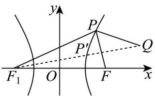

> [!faq]- 《专题3_2_双曲线_高效培优讲义_》官方解析
>
> > [!success]- **【答案】** B
>
> > [!note]- **【解析】**
> > 如图，设双曲线的左焦点为 $F_{1}$
> >
> > 由双曲线的定义得 $\left|PF\right|+\left|PQ\right|=\left|PF_{1}\right|+\left|PQ\right|-2a\quad\left|QF_{1}\right|-2\sqrt{5}=5\sqrt{5}-2\sqrt{5}=3\sqrt{5}$ 所以 $\left|PF\right|+\left|PQ\right|$ 的最小值为 $3\sqrt{5}$ .
> >
> > 故选：B.
> >
> > 
