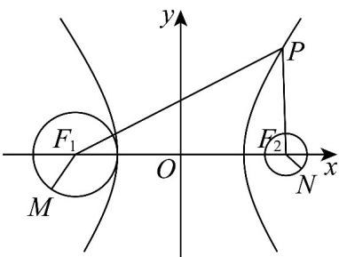

> [!faq]- 《专题3_2_双曲线_高效培优讲义_》官方解析
>
> > [!success]- **【答案】** D
>
> > [!note]- **【解析】**
> > 双曲线 $\frac{x^{2}}{9}-\frac{y^{2}}{16}=1$ 中，如图所示：
> >
> > 
> >
> > ，，，，设左、右焦点为 ，，
> > ∵ a = 3 b = 4 c = 5 $F_{1}$ $F_{2}$
> >
> > $\therefore F_{1}(-5,0)\quad F_{2}(5,0)$
> >
> > $$
> > \because \left| P F _ {1} \right| - \left| P F _ {2} \right| = 2 a = 6
> > $$
> >
> > $\therefore \left|PM\right|\leq \left|PF_{1}\right| + \left|MF_{1}\right|$ ， $P,F_{1},M$ 三点共线且 $F_{1}$ 在 $P,M$ 之间时取等号，
> >
> > $\left|PN\right|\quad\left|PF_{2}\right|-\left|NF_{2}\right|$ ，则 $-\left|PN\right|\leq-\left|PF_{2}\right|+\left|NF_{2}\right|$ ， $P,F_{2},N$ 共线且N在 $P,F_{2}$ 之间时取等号，
> >
> > 所以 $\left|PM\right|-\left|PN\right|\leq\left|PF_{1}\right|+\left|MF_{1}\right|-\left|PF_{2}\right|+\left|NF_{2}\right|=6+1+2=9$
> >
> > 故选 **D**
