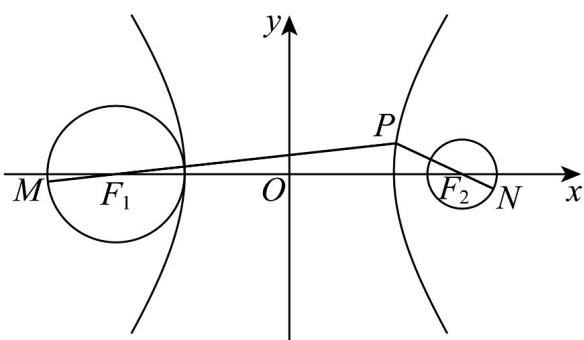

> [!faq]- 《专题3_2_双曲线_高效培优讲义_》官方解析
>
> > [!success]- **【答案】** B
>
> > [!note]- **【解析】**
> > 
> >
> > 由 $\frac{x^2}{9} -\frac{y^2}{16} = 1$ ，得 $a^2 = 9$ ， $b^{2} = 16$ ，则 $c^2 = a^2 +b^2 = 25$
> >
> > 则双曲线的两个焦点 $F_{1}(-5,0)$ ， $F_{2}(5,0)$ ，
> >
> > 又 $F_{1}(-5,0)$ ， $F_{2}(5,0)$ 分别是两个圆的圆心，两圆的半径 $r_1 = 2, r_2 = 1$
> >
> > 所以 $\left|PM\right|_{\max}=\left|PF_{1}\right|+2,\quad\left|PN\right|_{\min}=\left|PF_{2}\right|-1$
> >
> > 则 $(|PM| - |PN|)_{\max} = |PM|_{\max} - |PN|_{\min} = (|PF_1| + 2) - (|PF_2| - 1)$
> >
> > $$
> > = \left| P F _ {1} \right| - \left| P F _ {2} \right| + 3 = 2 \times 3 + 3 = 9
> > $$
> >
> > 即 $\left|PM\right|-\left|PN\right|$ 的最大值为9.
> >
> > 故选 **B**.
