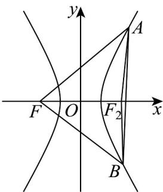

## 题型05 双曲线上两线段的和差最值问题

【典例1】已知双曲线 $\Gamma : x^2 - \frac{y^2}{3} = 1$ 的左焦点为 $F$ ，点 $A, B$ 在 $\Gamma$ 的右支上，且 $|AB| = 6$ ，则 $|FA| + |FB|$ 的最小值为（） A.4 B.6 C.10 D.14

【答案】C

【详解】对于双曲线 $x^{2} - \frac{y^{2}}{3} = 1$ ，根据双曲线的标准方程 $\frac{x^2}{a^2} -\frac{y^2}{b^2} = 1$ （ $a > 0,b > 0$ ），可得 $a^2 = 1$ ， $b^{2} = 3$ .则 $a = 1$

设双曲线的右焦点为 $F_{2}$ ，由双曲线的定义可知，点A在双曲线的右支上，则 $\left|FA\right| - \left|F_{2}A\right| = 2a = 2$ ，即 $|FA| = |F_2A| + 2$

同理，点 $B$ 在双曲线的右支上，则 $\left|FB\right| - \left|F_2B\right| = 2a = 2$ ，即 $\left|FB\right| = \left|F_2B\right| + 2$

所以 $|FA| + |FB| = (|F_2A| + 2) + (|F_2B| + 2) = |F_2A| + |F_2B| + 4$ .

根据三角形三边关系， $\left|F_{2}A\right|+\left|F_{2}B\right|\quad\left|AB\right|$ ，当且仅当A，B， $F_{2}$ 三点共线时，等号成立。
又 $\left|AB\right|=6$ ，则 $\left|F_{2}A\right|+\left|F_{2}B\right|+4$ $\left|AB\right|+4=6+4=10$ ，即 $\left|FA\right|+\left|FB\right|$ 10

所以 $\left| FA \right| + \left| FB \right|$ 的最小值为 10.

故选：C.

## 方法技巧

双曲线中线段之和差的最值·根据双曲线的第一定义，利用三角形中两边之和大于第三边，三角形中两边之差
小于第三边，处理线段之和的最值问题时，画出图形，利用几何图形的性质三点共线线段之和取得最值
![[高中/课堂同步/题库/人教A版高中数学同步讲义(2026)/03_选择性必修第一册/第三章 圆锥曲线的方程/讲义/专题3_2_双曲线_高效培优讲义_/题型05_双曲线上两线段的和差最值问题_sec_19/questions/Q00063083.md]]
![[高中/课堂同步/题库/人教A版高中数学同步讲义(2026)/03_选择性必修第一册/第三章 圆锥曲线的方程/讲义/专题3_2_双曲线_高效培优讲义_/题型05_双曲线上两线段的和差最值问题_sec_19/questions/Q00063084.md]]
![[高中/课堂同步/题库/人教A版高中数学同步讲义(2026)/03_选择性必修第一册/第三章 圆锥曲线的方程/讲义/专题3_2_双曲线_高效培优讲义_/题型05_双曲线上两线段的和差最值问题_sec_19/questions/Q00063085.md]]
