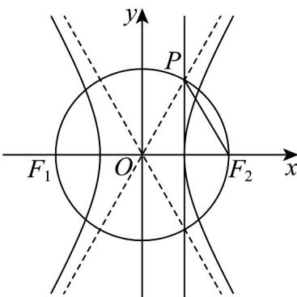

> [!faq]- 《专题3_2_双曲线_高效培优讲义_》官方解析
>
> > [!success]- **【答案】** C
>
> > [!note]- **【解析】**
> > 如图，根据圆的性质可知 $\angle OF_{2}P = \angle OPF_{2}$
> >
> > 又点 $P$ 在线段 $OF_{2}$ 中垂线上，则 $\angle OF_{2}P = \angle POF_{2}$ ，则 $\triangle OPF_{2}$ 是等边三角形，故双曲线渐近线 $OP$ 的倾斜角为 $60^{\circ}$ 。所以 $\frac{b}{a} = \tan 60^{\circ} = \sqrt{3}$ ，即 $b^{2} = 3a^{2}$ ，则双曲线方程为 $\frac{x^{2}}{a^{2}} - \frac{y^{2}}{3a^{2}} = 1$ 。将点 $(2, \sqrt{3})$ 代入双曲线方程，得 $\frac{4}{a^{2}} - \frac{3}{3a^{2}} = 1$ ，解得 $a^{2} = 3$ ，则双曲线方程为 $\frac{x^{2}}{3} - \frac{y^{2}}{9} = 1$ ，
> >
> > 故选：C.
> >
> > 
