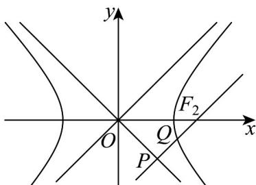

## 题型07 双曲线的渐近线

【典例1】已知双曲线 $C: \frac{x^2}{a^2} - \frac{y^2}{b^2} = 1 (a > 0, b > 0)$ 的左、右焦点分别为 $F_1, F_2, l_1, l_2$ 分别为双曲线 $C$ 的两条渐近线直线 $l$ 过点 $F_2$ ，且 $l // l_1$ ，直线 $l$ 与 $l_2$ 交于点 $P$ ，直线 $l$ 与双曲线 $C$ 的右半支交于点 $Q$ ，且 $\overline{F_2Q} = \overline{QP}$ ，则双曲线 $C$ 的离心率为（）A. $\sqrt{2}$ B. $\frac{3}{2}$ C. $\sqrt{3}$ D. 2

【答案】A

【详解】

由题意，得渐近线 $l_{1}, l_{2}$ 的方程为 $y = \pm \frac{b}{a} x, F_{1}(-c, 0), F_{2}(c, 0)$ 。不妨设直线 $l$ 的方程为 $y = \frac{b}{a}(x - c)$ ， $P(x_{1}, y_{1}), Q(x_{2}, y_{2})$ 。由 $\left\{ \begin{array}{l} y = \frac{b}{a} (x - c), \\ y = -\frac{b}{a} x, \quad \text{解得} \\ x_{1} = \frac{c}{2}, y_{1} = -\frac{bc}{2a}, \therefore P\left(\frac{c}{2}, -\frac{bc}{2a}\right) \end{array} \right.$ 又 $\because F_{2}Q = QP$ ，且 $\left( x_{2} - c, y_{2} \right), QP = \left( \frac{c}{2} - x_{2}, -\frac{bc}{2a} - y_{2} \right), \therefore \left\{ \begin{array}{l} x_{2} - c = \frac{c}{2} - x_{2}, \\ y_{2} = -\frac{bc}{2a} - y_{2}, \end{array} \right.$

解得 $x_{2} = \frac{3}{4} c, y_{2} = -\frac{bc}{4a}, \therefore Q\left(\frac{3}{4} c, -\frac{bc}{4a}\right)$ ，代入双曲线 $C: \frac{x^2}{a^2} - \frac{y^2}{b^2} = 1$ ，得 $\frac{9c^2}{16a^2} - \frac{c^2}{16a^2} = 1$

解得 $\frac{c^2}{a^2} = 2, \therefore$ 双曲线 $C$ 的离心率 $e = \frac{c}{a} = \sqrt{2}$

故选：A.

## 方法技巧

1、若双曲线方程为 $\frac{x^2}{a^2} -\frac{y^2}{b^2} = 1(a > 0,b > 0)\Rightarrow$ 渐近线方程： $\frac{x^2}{a^2} -\frac{y^2}{b^2} = 0\Leftrightarrow y = \pm \frac{b}{a} x$

2、若双曲线方程为 $\frac{y^2}{a^2} -\frac{x^2}{b^2} = 1$ （ $a > 0$ ， $b > 0$ ） $\Rightarrow$ 渐近线方程： $\frac{y^2}{a^2} -\frac{x^2}{b^2} = 0$ $\Leftrightarrow y = \pm \frac{a}{b} x$

3、若渐近线方程为 $y = \pm \frac{n}{m} x$ ，则双曲线方程可设为 $\frac{x^2}{m^2} - \frac{y^2}{n^2} = \lambda (\lambda \neq 0)$

$\frac{x^2}{a^2} - \frac{y^2}{b^2} = 1$ 有公共渐近线，则双曲线的方程可设为 $\frac{x^2}{a^2} - \frac{y^2}{b^2} = \lambda$ （ $\lambda > 0$ ，焦点在 $x$ 轴上，

$$
\lambda <   0
$$

$$
y
$$

![[高中/课堂同步/题库/人教A版高中数学同步讲义(2026)/03_选择性必修第一册/第三章 圆锥曲线的方程/讲义/专题3_2_双曲线_高效培优讲义_/题型07_双曲线的渐近线_sec_21/questions/Q00063089.md]]
![[高中/课堂同步/题库/人教A版高中数学同步讲义(2026)/03_选择性必修第一册/第三章 圆锥曲线的方程/讲义/专题3_2_双曲线_高效培优讲义_/题型07_双曲线的渐近线_sec_21/questions/Q00063090.md]]
![[高中/课堂同步/题库/人教A版高中数学同步讲义(2026)/03_选择性必修第一册/第三章 圆锥曲线的方程/讲义/专题3_2_双曲线_高效培优讲义_/题型07_双曲线的渐近线_sec_21/questions/Q00063091.md]]
