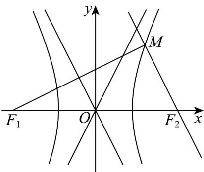

> [!faq]- 《专题3_2_双曲线_高效培优讲义_》官方解析
>
> > [!success]- **【答案】** B
>
> > [!note]- **【解析】**
> > 由题意可作图如下：
> >
> > 
> >
> > 易知 $\left|MF_{1}\right|-\left|MF_{2}\right|=2\left|MF_{2}\right|-\left|MF_{2}\right|=\left|MF_{2}\right|=2a,\quad\left|MF_{1}\right|=4a$
> >
> > $\tan \angle MF_2F_1 = \frac{b}{a}$ ，则 $\cos \angle MF_2F_1 = \frac{a}{\sqrt{a^2 + b^2}} = \frac{a}{c}$
> >
> > 在 $\triangle MF_1F_2$ 中， $\cos \angle MF_2F_1 = \frac{\left|MF_2\right|^2 + \left|F_1F_2\right|^2 - \left|MF_1\right|^2}{2 \cdot \left|MF_2\right| \cdot \left|F_1F_2\right|}$ ， $\frac{a}{c} = \frac{4a^2 + 4c^2 - 16a^2}{8ac}$ ，
> >
> > 整理可得 $2a^{2} = c^{2} - 3a^{2}$ ，解得 $5a^{2} = c^{2}$ ，所以 $e = \frac{c}{a} = \sqrt{5}$
> >
> > 故选 **B**.
