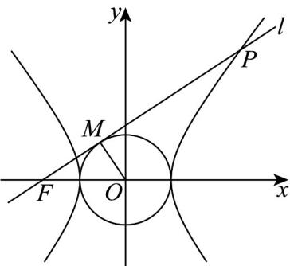

## 题型8 求双曲线离心率的值和范围

【典例1】设 $a > 0$ ， $b > 0$ ，点 $M\left(x_0,y_0\right)$ ， $O$ 是坐标原点， $\left|OM\right| = a$ ， $F$ 是双曲线 $\Gamma :\frac{x^2}{a^2} -\frac{y^2}{b^2} = 1$ 的左焦点，

若直线 $l: x_0x + y_0y = a^2$ 经过点 $F$ ，且能与双曲线 $\Gamma$ 的右支在第一象限内交于 $P$ 点，则双曲线 $\Gamma$ 的离心率的一个可能的值是（ ）A. $\frac{\sqrt{11}}{3}$ B. $\sqrt{2}$ C. $\frac{\sqrt{5}}{2}$ D. $\sqrt{3}$

【答案】D

【详解】由 $|OM| = a$ ，知 $x_0^2 + y_0^2 = a^2$

因为直线 $l: x_{0}x + y_{0}y = a^{2}$

所以点 $O$ 到直线 $l$ 的距离为 $\frac{\left|0 + 0 - a^2\right|}{\sqrt{x_0^2 + y_0^2}} = \frac{a^2}{a} = a = |OM|$

所以 $OM \perp l$ ，

由题意知， $|OF| = c$

所以 $\left|MF\right|=\sqrt{\left|OF\right|^{2}-\left|OM\right|^{2}}=\sqrt{c^{2}-a^{2}}=b,\quad\tan\angle OFM=\frac{\left|OM\right|}{\left|MF\right|}=\frac{a}{b}$ ，即直线l的斜率为 $\frac{a}{b}$

又直线 $l$ 经过点 $F(-c,0)$ ，所以直线 $l$ 的方程为 $y = \frac{a}{b} (x + c)$

联立 $\left\{ \begin{array}{l} y = \frac{a}{b} (x + c) \\ \frac{x^2}{a^2} - \frac{y^2}{b^2} = 1 \end{array} \Rightarrow (\frac{b^4 - a^4}{b^2}) x^2 - \frac{2a^4c}{b^2} x - \frac{a^4c^2}{b^2} - a^2 b^2 = 0 \right.$

由题意知，直线 $l$ 与双曲线的左右两支各有一个交点，所以 $\frac{-\frac{a^4c^2}{b^2} - a^2b^2}{\frac{b^4 - a^4}{b^2}} < 0$ ，即 $b^4 > a^4$ ，所以 $b > a$

所以双曲线的离心率 $e=\sqrt{1+\left(\frac{b}{a}\right)^{2}}>\sqrt{2}$

对比选项可知，只有选项 $^{D}$ 符合题意。

故选：D.

## 方法技巧

求双曲线离心率的两种方法

(1)直接法：若已知 $a$ ，c可直接利用 $\mathrm{e} =$ 求解，若已知 $a$ ，b，可利用 $\mathrm{e} =$ 求解.

(2)方程法：若无法求出 $a, b, c$ 的具体值，但根据条件可确定 $a, b, c$ 之间的关系，可通过 $b2 = c2 - a2$ ，将关系式转化为关于 $a, c$ 的齐次方程，借助于 $e =$ ，转化为关于 $e$ 的 $n$ 次方程求解。如若得到的是关于 $a, c$ 的齐次方程 $pc2 + q \cdot ac + r \cdot a2 = 0 (p, q, r$ 为常数，且 $p \neq 0)$ ，则转化为关于 $e$ 的方程 $pe2 + q \cdot e + r = 0$ 求解。

![[高中/课堂同步/题库/人教A版高中数学同步讲义(2026)/03_选择性必修第一册/第三章 圆锥曲线的方程/讲义/专题3_2_双曲线_高效培优讲义_/题型8_求双曲线离心率的值和范围_sec_22/questions/Q00063092.md]]
![[高中/课堂同步/题库/人教A版高中数学同步讲义(2026)/03_选择性必修第一册/第三章 圆锥曲线的方程/讲义/专题3_2_双曲线_高效培优讲义_/题型8_求双曲线离心率的值和范围_sec_22/questions/Q00063093.md]]
![[高中/课堂同步/题库/人教A版高中数学同步讲义(2026)/03_选择性必修第一册/第三章 圆锥曲线的方程/讲义/专题3_2_双曲线_高效培优讲义_/题型8_求双曲线离心率的值和范围_sec_22/questions/Q00063094.md]]
