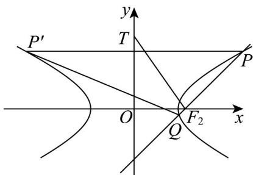

> [!faq]- 《专题3_2_双曲线_高效培优讲义_》官方解析
>
> > [!success]- **【答案】** (1) $\frac{x^{2}}{3}-y^{2}=1$ ; (2) (i) $\left(0, \frac{-8t}{t^2 - 3}\right)$ ; (ii) $(1, \sqrt{3}]$ .
>
> > [!note]- **【解析】**
> > （1）由双曲线的方程知， $a=\sqrt{3}$ ，又离心率 $e=\frac{2\sqrt{3}}{3}=\frac{2}{\sqrt{3}}$ ，故c=2，
> >
> > 因为 $b^{2}=c^{2}-a^{2}=1$ ，
> >
> > 故双曲线的方程为 $\frac{x^{2}}{3}-y^{2}=1$ ;
> >
> > (2) (i) 直线 PQ 的方程为 x = ty + 2 ,
> >
> > 联立 $\left\{ \begin{array}{l} \frac{x^2}{3} - y^2 = 1 \\ x = ty + 2 \end{array} \right.$ ，得 $\left(t^2 - 3\right)y^2 + 4ty + 1 = 0$ ，
> >
> > 故 $t^2 - 31$ 0且 $\Delta = 16t^2 - 4(t^2 - 3) = 12t^2 + 12 > 0$
> >
> > 设 $P(x_{1},y_{1}),Q(x_{2},y_{2}),P^{\prime}(-x_{1},y_{1})$
> >
> > 则 $y_{1} + y_{2} = -\frac{4t}{t^{2} - 3},y_{1}y_{2} = \frac{1}{t^{2} - 3}$
> >
> > $$
> > x _ {1} + x _ {2} = t \left(y _ {1} + y _ {2}\right) + 4 = - \frac {1 2}{t ^ {2} - 3}, x _ {1} x _ {2} = t ^ {2} y _ {1} y _ {2} + 2 t \left(y _ {1} + y _ {2}\right) + 4 = \frac {- 3 t ^ {2} - 1 2}{t ^ {2} - 3}
> > $$
> >
> > 由已知 $-\frac{12}{t^2 - 3} > 0, \frac{-3t^2 - 12}{t^2 - 3} > 0$ ，所以 $-\sqrt{3} < t < \sqrt{3}$
> >
> > 所以线段 $PQ$ 的中点坐标为 $\left(-\frac{6}{t^2 - 3}, -\frac{2t}{t^2 - 3}\right)$
> >
> > 所以线段 $PQ$ 的垂直平分线方程为 $y + \frac{2t}{t^2 - 3} = -t\left(x + \frac{6}{t^2 - 3}\right)$
> >
> > 又线段 $PP'$ 的垂直平分线方程为 x = 0
> >
> > 所以点 $T$ 的坐标为 $\left(0, \frac{-8t}{t^2 - 3}\right)$
> >
> > （ii）由题意，右焦点 $F_{2}(2,0)$ ，故 $\left|TF_2\right| = \sqrt{(2 - 0)^2 + \left(0 + \frac{8t}{t^2 - 3}\right)^2} = \frac{2}{3 - t^2}\sqrt{t^4 + 10t^2 + 9}$
> >
> > $$
> > \left| P Q \right| = \sqrt {1 + t ^ {2}} \left| y _ {2} - y _ {1} \right| = \sqrt {1 + t ^ {2}} \cdot \frac {\sqrt {1 2 t ^ {2} + 1 2}}{3 - t ^ {2}} = \frac {2 \sqrt {3} (t ^ {2} + 1)}{3 - t ^ {2}}
> > $$
> >
> > 所以 $\frac{\left|TF_{2}\right|}{\left|PQ\right|}=\frac{\sqrt{t^{4}+10t^{2}+9}}{\sqrt{3}(t^{2}+1)}=\frac{\sqrt{3}}{3}\sqrt{\frac{t^{2}+9}{t^{2}+1}}=\frac{\sqrt{3}}{3}\sqrt{1+\frac{8}{t^{2}+1}}$ ，则由 $-\sqrt{3}<t<\sqrt{3}$ 知，
> >
> > 所以 $t^2 + 1 \in (1,4)$ ，即 $\sqrt{1 + \frac{8}{t^2 + 1}} \in (3,9)$
> >
> > 所以 $\frac{|TF_{2}|}{|PQ|}$ 的取值范围为 $(1,\sqrt{3}]$
> >
> > 
