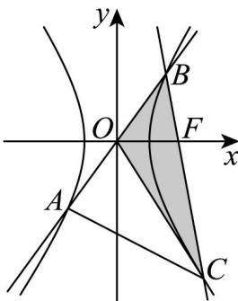
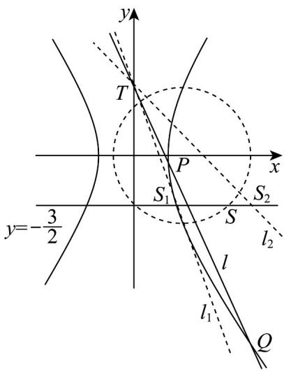

> [!faq]- 《专题3_2_双曲线_高效培优讲义_》官方解析
>
> > [!success]- **【答案】** (1) $x^{2}-\frac{y^{2}}{3}=1$ (2) $3x-\sqrt{7}y-6=0$ 或 $3x+\sqrt{7}y-6=0$ 或 x=2 (3) $\left[5,\frac{53}{3}-7\sqrt{3}\right)$
>
> > [!note]- **【解析】**
> > （1）圆锥曲线 E 的离心率为 2，故 E 为双曲线，
> >
> > 因为 $E$ 中心在原点、焦点在 $x$ 轴上，所以设 $E$ 的方程为 $\frac{x^2}{a^2} -\frac{y^2}{b^2} = 1$ （ $a > 0$ ， $b > 0$ ）
> >
> > 令 $x = c$ ，解得 $y = \pm \frac{b^2}{a}$ ，所以有 $\frac{2b^2}{a} = 6$ ①
> >
> > 又由离心率为 $^{2}$ ，得 $\sqrt{1+\frac{b^{2}}{a^{2}}}=2$ ②，
> >
> > 由①②解得 $\left\{ \begin{array}{l} a^2 = 1 \\ b^2 = 3 \end{array} \right.$ ，所以双曲线 $E$ 的标准方程是 $x^2 - \frac{y^2}{3} = 1$ ；
> >
> > (2) 设 $B(x_{1}, y_{1})$ , $C(x_{2}, y_{2})$ ，由已知，得 $F(2, 0)$ ，根据直线 AB 过原点及对称性，
> >
> > 知 $S_{\triangle ABC} = 2S_{\triangle BOC} = 2 \times \frac{1}{2} \cdot |OF| \cdot |y_1 - y_2| = c \cdot |y_1 - y_2| = 2 |y_1 - y_2| = 12$
> >
> > 由题意可知直线 BC 的斜率不为 0，
> >
> > 设直线 BC 的方程为 $x = my + 2$ ，
> >
> > 联立直线 $BC$ 与双曲线 $E$ 的方程，得 $\left\{ \begin{array}{l} x^2 - \frac{y^2}{3} = 1 \\ x = my + 2 \end{array} \right.$
> >
> > 化简整理，得 $\left(3m^2 - 1\right)y^2 + 12my + 9 = 0$
> >
> > 所以 $\left\{ \begin{array}{l} y_{1} + y_{2} = -\frac{12m}{3m^{2} - 1} \\ y_{1}y_{2} = \frac{9}{3m^{2} - 1} \end{array} \right.$ ，且 $\Delta = 144m^{2} - 36(3m^{2} - 1) = 36m^{2} + 36 > 0$
> >
> > 所以 $S_{\triangle ABC} = 2\left|y_1 - y_2\right| = 2\sqrt{\left(y_1 + y_2\right)^2 - 4y_1y_2} = 2 \cdot \frac{6\sqrt{m^2 + 1}}{\left|3m^2 - 1\right|} = 12$
> >
> > 整理得 $9m^{4}-7m^{2}=0$ ，解得 $m=\pm\frac{\sqrt{7}}{3}$ 或m=0，
> >
> > 所以直线 $BC$ 的方程是 $3x - \sqrt{7} y - 6 = 0$ 或 $3x + \sqrt{7} y - 6 = 0$ 或 $x = 2$ .
> >
> > 
> >
> > (3) 若直线 $l$ 斜率不存在，此时直线 $l$ 与双曲线右支无交点，不合题意，
> >
> > 故直线 $l$ 斜率存在，设直线 $l$ 方程 $y = kx + 2$ ， $P(x_3, y_3)$ ， $Q(x_4, y_4)$
> >
> > 联立直线 $l$ 与双曲线 $E$ 的方程，得 $\left\{ \begin{array}{l} x^2 - \frac{y^2}{3} = 1 \\ y = kx + 2 \end{array} \right.$
> >
> > 化简整理，得 $\left(3 - k^2\right)x^2 - 4kx - 7 = 0$
> >
> > 所以 $x_{3} + x_{4} = \frac{4k}{3 - k^{2}}$ ， $x_{3}x_{4} = \frac{-7}{3 - k^{2}}$ ，且 $\Delta = 16k^2 +28(3 - k^2) = 84 - 12k^2 >0$
> >
> > ∵直线l与E在y轴的右侧交于不同的两点P，Q，
> >
> > $\therefore \left\{ \begin{array}{l} \Delta = 84 - 12k^2 > 0 \\ 3 - k^2 \neq 0 \\ \frac{4k}{3 - k^2} > 0 \\ -\frac{-7}{3 - k^2} > 0 \end{array} \right. \Rightarrow \left\{ \begin{array}{l} k^2 < 7 \\ k^2 \neq 3 \\ k^2 > 3 \\ k < 0 \end{array} \right.$ ，解得 $-\sqrt{7} < k < -\sqrt{3}$ 设点S的坐标为 $\left(x_{0},y_{0}\right)$ ，由 $\overline{TP}\cdot\overline{SQ}=\overline{PS}\cdot\overline{TQ}$ ，得 $\frac{|TP|}{|TQ|}=\frac{|SP|}{|SQ|}$
> >
> > 则 $\frac{x_{3}}{x_{4}}=\frac{x_{0}-x_{3}}{x_{4}-x_{0}}$ ，变形得到 $2x_{3}x_{4}=(x_{3}+x_{4})x_{0}$ ， $x_{0}=\frac{2x_{3}x_{4}}{x_{3}+x_{4}}=-\frac{7}{2k}$
> >
> > 代入 $y = kx + 2$ 中，解得 $y_0 = -\frac{3}{2}$
> >
> > 设过点 $T$ 与双曲线 $E$ 右支相切的直线为 $l_{1}$ ， $l_{1}$ 与 $y = -\frac{3}{2}$ 的交点为 $S_{1}$
> >
> > 过点 $T$ 与双曲线 $E$ 的渐近线 $y = -\sqrt{3} x$ 平行的直线为 $l_{2}$ ， $l_{2}$ 与 $y = -\frac{3}{2}$ 的交点为 $S_{2}$ ，
> >
> > ∴ S 点的轨迹为线段 $S_{1}S_{2}$ （不含端点），
> >
> > 由 $\left\{ \begin{array}{l} y = -\sqrt{7} x + 2 \\ y = -\frac{3}{2} \end{array} \right.$ 解得 $S_{1}\left(\frac{\sqrt{7}}{2}, -\frac{3}{2}\right)$ ，由 $\left\{ \begin{array}{l} y = -\sqrt{3} x + 2 \\ y = -\frac{3}{2} \end{array} \right.$ 解得 $S_{2}\left(\frac{7\sqrt{3}}{6}, -\frac{3}{2}\right)$ ，
> >
> > $$
> > \left| S M \right| ^ {2} + \left| S F \right| ^ {2} = t, \quad \left(x _ {0} - 1\right) ^ {2} + \left(x _ {0} - 2\right) ^ {2} + 2 y _ {0} ^ {2} = t,
> > $$
> >
> > 整理得 $\left(x_0 - \frac{3}{2}\right)^2 + y_0^2 = \frac{2t - 1}{4}, t > \frac{1}{2}$
> >
> > 即 S 点的轨迹为以 $\left(\frac{3}{2},0\right)$ 为圆心， $\sqrt{\frac{2t-1}{4}}$ 为半径的圆与线段 $S_{1}S_{2}$ 的交点，
> >
> > $\therefore \frac{\sqrt{7}}{2} < \frac{3}{2} < \frac{7\sqrt{3}}{6}$ ， $\therefore \frac{9}{4} \leq \frac{2t - 1}{4} < \left(\frac{7\sqrt{3}}{6} - \frac{3}{2}\right)^2 + \left(\frac{3}{2}\right)^2$ ，解得 $5 \leq t < \frac{53}{3} - 7\sqrt{3}$
> >
> > ∴ t 的范围是 $\left[5, \frac{53}{3} - 7\sqrt{3}\right)$ .
> >
> > 
