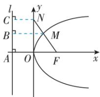
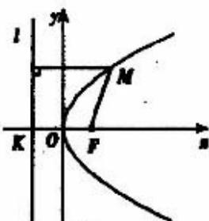

> [!faq]- 《专题3_3_抛物线_高效培优讲义_》官方解析
>
> > [!success]- **【答案】** 6
>
> > [!note]- **【解析】**
> > 方法一、抛物线 $y^{2}=8x$ 的焦点为 $F(2,0)$ ，Q N 点在 y 轴上，设 $N(0,y_{N})$ .
> >
> > 又∵ M 为 FN 的中点，∴ $M\left(\frac{2+0}{2}, \frac{0+y_{N}}{2}\right)$ ，即 $M\left(1, \frac{y_{N}}{2}\right)$
> >
> > 又∵ M 点在抛物线 $y^{2}=8x$ 上，∴ $\left(\frac{y_{N}}{2}\right)^{2}=8\Rightarrow y_{N}^{2}=32$
> >
> > 所以 $\left|FN\right|=\sqrt{2^{2}+y_{N}^{2}}=\sqrt{4+32}=6$ .
> >
> > 方法二、依题意，抛物线 $C: y^{2} = 8x$ 的焦点 $F(2,0)$ ，准线 x = -2，
> >
> > ∵ M 是 C 上一点，FM 的延长线交 y 轴于点 N, M 为 FN 的中点，
> >
> > ∴ 点 M 的横坐标为 1，∴ $\left|MF\right|=1-\left(-2\right)=3,\left|FN\right|=2\left|MF\right|=6$
> >
> > 方法三、抛物线 $y^{2}=8x$ 的焦点为 $F(2,0)$ ，准线 x=-2，
> >
> > 如图，设 l 与 x 轴的交点为 A，分别过 N, M 作直线 l 的垂线，垂足分别为 C, B
> >
> > 由 M 为 FN 的中点，易知线段 BM 为梯形 AFNC 的中位线，
> >
> > $$
> > \because | C N | = 2, | A F | = 4, \therefore | M B | = 3
> > $$
> >
> > 又由抛物线的定义得 $\left|MB\right|=\left|MF\right|$ ，且 $\left|MN\right|=\left|MF\right|$
> >
> > $$
> > \therefore | N F | = | N M | + | M F | = 2 | M F | = 2 | M B | = 6
> > $$
> >
> > 
> >
> > 故答案为：6.
> >
> > 知识点 02 抛物线的标准方程
> >
> > 如图，以过 $F$ 且垂直于 $l$ 的直线为 $x$ 轴，垂足为 $K$ 。以 $F, K$ 的中点 $O$ 为坐标原点建立直角坐标系 $xOy$
> >
> > 
> >
> > 设 $\left|KF\right|=p\quad(p>0)$ ，那么焦点F的坐标为 $\left(\frac{p}{2},0\right)$ ，准线l的方程为 $x=-\frac{p}{2}$
> >
> > 设点 $M(x,y)$ 是抛物线上任意一点，点 $M$ 到 $l$ 的距离为 $d$ 。由抛物线的定义，抛物线就是集合
> >
> > $$
> > P = \{M | M F = d \}
> > $$
> >
> > $$
> > \because | M F | = \sqrt {\left(x - \frac {p}{2}\right) ^ {2} + y ^ {2}} \quad d = \left| x + \frac {p}{2} \right| \therefore \sqrt {\left(x - \frac {p}{2}\right) ^ {2} + y ^ {2}} = \left| x + \frac {p}{2} \right|
> > $$
> >
> > 将上式两边平方并化简，得 $y^{2} = 2px (p > 0)$ 。
> > - **①**：方程①叫抛物线的标准方程，它表示的抛物线的焦点在 $x$ 轴的正半轴上，坐标是 $\frac{(p)}{2}, 0)$ 它的准线方程是 $x = -\frac{p}{2}$ .
> >
> > 抛物线标准方程的四种形式：
> >
> > 根据抛物线焦点所在半轴的不同可得抛物线方程的的四种形式
> >
> > $$
> > y ^ {2} = 2 p x, y ^ {2} = - 2 p x, x ^ {2} = 2 p y, x ^ {2} = - 2 p y (p > 0)
> > $$
