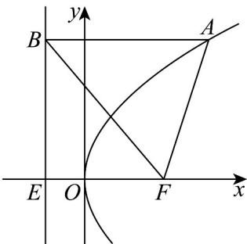

> [!faq]- 《专题3_3_抛物线_高效培优讲义_》官方解析
>
> > [!success]- **【答案】** C
>
> > [!note]- **【解析】**
> > 由题意可知：抛物线 C 的焦点 $F\left(\frac{p}{2},0\right)$ ，准线为 $x=-\frac{p}{2}$ ，且 $\left|AF\right|=\left|AB\right|=10$ ，
> > 因为 $\cos\angle BAF=\frac{3}{5}$ 所以由余弦定理得 $2\left|AF\right|^{2}-2\left|AF\right|^{2}\cos\angle BAF=200\times\left(1-\frac{3}{5}\right)=80=\left|BF\right|^{2}$ 即 $\left|BF\right|=4\sqrt{5}$ ;
> >
> > 由 $\left|AF\right|=x_{A}+\frac{p}{2}=10$ ，所以 $x_{A}=10-\frac{p}{2}$ ， $y_{A}^{2}=2px_{A}=20p-p^{2}$ ；
> >
> > 设 E 为准线与 x 轴的交点， $\left|EF\right|=p$ ，
> >
> > 则 $\left|EF\right|^{2}+y_{A}^{2}=p^{2}+20p-p^{2}=\left|BF\right|^{2}=80$ ，则 p=4。
> >
> > 
> >
> > 故选：C.
> >
> > 2. 点 $M(5,3)$ 到抛物线 $y = ax^2$ 的准线的距离为 6，那么该抛物线的标准方程是（）A. $x^2 = 12y$ B. $x^2 = \frac{1}{12} y$ 或 $x^2 = -\frac{1}{36} y$ C. $x^2 = -\frac{1}{36} y$ D. $x^2 = 12y$ 或 $x^2 = -36y$
> >
> > 【答案】D
> >
> > 【详解】将 $y = ax^{2}$ 转化为 $x^{2} = \frac{1}{a}y$ ,
> >
> > 当 $a > 0$ 时，抛物线开口向上，准线方程 $y = -\frac{1}{4a}$ 点 $M(5,3)$ 到准线的距离为 $3 + \frac{1}{4a} = 6$ ，解得 $a = \frac{1}{12}$ 所以抛物线方程为 $y = \frac{1}{12} x^2$ ，即 $x^{2} = 12y$ 当 $a < 0$ 时，抛物线开口向下，准线方程 $y = -\frac{1}{4a}$ 点 $M(5,3)$ 到准线的距离为 $\left|3+\frac{1}{4a}\right|=6$ ，解得 $a=-\frac{1}{36}$ 或 $a=\frac{1}{12}$ （舍去），
> >
> > 所以抛物线方程为 $y = -\frac{1}{36}x^{2}$ ，即 $x^{2} = -36y$ .
> >
> > 所以抛物线的方程为 $x^{2}=12y$ 或 $x^{2}=-36y$
> >
> > 故选 **D**.
