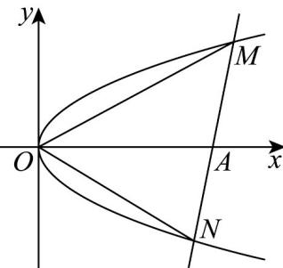

> [!faq]- 《专题3_3_抛物线_高效培优讲义_》官方解析
>
> > [!success]- **【答案】** A
>
> > [!note]- **【解析】**
> > 由题意，直线 l 的斜率不为 0，可设直线方程为 $x = ty + 3$
> >
> > 设 $M(x_{1},y_{1})$ ， $N(x_{2},y_{2})$ ， $y_{1}>0$ ， $y_{2}<0$ ，
> >
> > 
> >
> > 联立可得 $\left\{\begin{aligned}x&=ty+3\\ y^{2}&=x\end{aligned}\right.$ ，消去 x 可得 $y^{2}-ty-3=0$ ， $\Delta=t^{2}+12>0$ ，
> >
> > 由韦达定律得 $y_{1} + y_{2} = t$ ， $y_{1}y_{2} = -3$ ，
> >
> > 由 $AM = (x_{1} - 3, y_{1})$ ， $AN = (x_{2} - 3, y_{2})$
> >
> > 又 $\overline{AM} + 4\overline{AN} = 0$ ，则 $y_{1} = -4y_{2}$ ，
> >
> > 由 $y_{1}y_{2} = -3$ ，则 $-4y_{2}^{2} = -3$ ，解得 $y_{2} = -\frac{\sqrt{3}}{2}$ ， $y_{1} = 2\sqrt{3}$
> >
> > 所以 $S_{\triangle OMN} = \frac{1}{2}\left|OA\right|\cdot \left|y_2 - y_1\right| = \frac{1}{2}\times 3\times \left(2\sqrt{3} +\frac{\sqrt{3}}{2}\right) = \frac{15\sqrt{3}}{4}$
> >
> > 故选 **A**.
