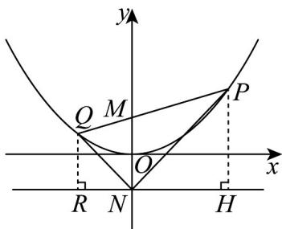

> [!faq]- 《专题3_3_抛物线_高效培优讲义_》官方解析
>
> > [!success]- **【答案】** (1)证明见解析 (2)证明见解析
>
> > [!note]- **【解析】**
> > （1）设点 $P$ 的坐标为 $\left(x_0, \frac{1}{4} x_0^2\right)$ ，则 $PM = \sqrt{x_0^2 + \left(\frac{1}{4} x_0^2 - 1\right)^2} = \sqrt{\left(\frac{1}{4} x_0^2 + 1\right)^2} = \frac{1}{4} x_0^2 + 1$ ；
> >
> > 又因为点 P 到直线 y = -1 的距离为 $\frac{1}{4}x_{0}^{2}-(-1)=\frac{1}{4}x_{0}^{2}+1$
> >
> > 所以，以点 $P$ 为圆心， $PM$ 为半径的圆与直线 $y = -1$ 的相切。
> >
> > (2) 如图，分别过点 $P, Q$ 作直线 $y = -1$ 的垂线，垂足分别为 $H, R$
> >
> > 由（1）知， $PH = PM$ ，同理可得， $QM = QR$
> >
> > 因为 $PH, MN, QR$ 都垂直于直线 $y = -1$ ，所以， $PH // MN // QR$
> >
> > 于是 $\frac{QM}{RN} = \frac{MP}{NH}$ ，所以 $\frac{QR}{RN} = \frac{PH}{HN}$ ，因此，Rt△PHN～Rt△QRN
> >
> > 于是 $\angle HNP = \angle RNQ$ ，从而 $\angle PNM = \angle QNM$ 。
> >
> > 
