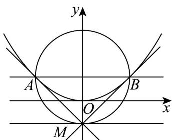

> [!faq]- 《专题3_3_抛物线_高效培优讲义_》官方解析
>
> > [!success]- **【答案】** (1) $\frac{x^{2}}{4}+y^{2}=1$ ， $x^{2}=4y$ (2) (i) 证明见解析，(0,1)；(ii) 证明见解析
>
> > [!note]- **【解析】**
> > （1）由题 $\left\{ \begin{array}{l} \frac{c}{a} = \frac{\sqrt{3}}{2} \\ 2a = 4 \\ b^2 = a^2 - c^2 \end{array} \right.$ ，解得 $a = 2, b = 1, c = \sqrt{3}$
> >
> > ∴椭圆 C 的方程为 $\frac{x^{2}}{4} + y^{2} = 1$ ，其上顶点坐标为 $(0,1)$ ，
> > ∴ $\frac{p}{2}=1$ ，即p=2.
> > ∴抛物线E的方程为 $x^{2}=4y$
> >
> > (2)
> >
> > 
> >
> > 由（1）知，抛物线 $E$ 的准线方程为 $y = -1$
> >
> > ∴可设 $M(t,-1)$ , $A(x_{1},y_{1})$ , $B(x_{2},y_{2})$
> >
> > (i) 由 $x^{2} = 4y$ 得 $y = \frac{1}{4} x^{2}$ ，且 $y' = \frac{1}{2} x$
> >
> > 又 $x_{1}^{2} = 4y_{1}$
> >
> > $\therefore$ 抛物线 $E$ 在 $A(x_{1},y_{1})$ 处的切线方程为 $y - y_{1} = \frac{1}{2} x_{1}(x - x_{1})$ ，即 $x_{1}x - 2y - 2y_{1} = 0$
> >
> > ∵ $M(t,-1)$ 在切线 $x_{1}x-2y-2y_{1}=0$ 上，
> >
> > ∴ $tx_{1}-2y_{1}+2=0$ ①
> >
> > 同理可得 $tx_{2}-2y_{2}+2=0$ ②，
> >
> > 由①②得直线 $AB$ 的方程为 $tx - 2y + 2 = 0$
> >
> > 令 x=0 ，则 y=1 ，
> >
> > 所以直线 $AB$ 恒过抛物线 $E$ 的焦点 $F(0,1)$
> >
> > (ii) 联立 $\left\{\begin{aligned}tx-2y+2&=0\\ x^{2}&=4y\end{aligned}\right.$ 得 $x^{2}-2tx-4=0$
> >
> > $$
> > x _ {1} + x _ {2} = 2 t, y _ {1} + y _ {2} = \frac {t x _ {1} + 2}{2} + \frac {t x _ {2} + 2}{2} = t ^ {2} + 2
> > $$
> >
> > 则线段 $AB$ 的中点为 $N\left(t, \frac{t^2 + 2}{2}\right)$ ， $|AB| = y_1 + y_2 + 2 = t^2 + 4$ ，
> >
> > 又 $x_{M} = x_{N} = t$
> >
> > ∴MN 与抛物线 E 的准线垂直，且 $\left|MN\right|=\frac{t^{2}+2}{2}-(-1)=\frac{t^{2}+4}{2}=\frac{1}{2}\left|AB\right|$
> >
> > 故以线段 AB 为直径的圆与抛物线 E 的准线相切于点 M .
> >
> > 11. 抛物线 $C: y^{2} = 2px(p > 0)$ 与直线 $l_{1}: y = x + 1$ 相切.
> >
> > (1)求抛物线 C 的方程.
> >
> > (2)设抛物线 $C$ 的焦点为 $F$ ，过 $F$ 的直线 $l_{2}$ 交 $C$ 于 $A$ ， $B$ ，点 $E(-1,1)$ 满足 $AE \perp BE$ ，求直线 $l_{2}$ 的方程.
> >
> > 【答案】(1) $y^{2}=4x$
> >
> > (2) $2x - y - 2 = 0$
> >
> > 【详解】（1）联立 $\left\{ \begin{array}{l} y^{2} = 2px \\ y = x + 1 \end{array} \right. \Rightarrow y^{2} = 2p(y - 1)$ ，可得 $y^{2} - 2py + 2p = 0$ ，
> >
> > 因为直线 $l_{1}: y = x + 1$ 与 $C: y^{2} = 2px (p > 0)$ 相切，
> >
> > 所以 $\triangle=4p^{2}-8p=0\Rightarrow p=2$
> >
> > 抛物线 C 的方程为 $y^{2}=4x$ .
> >
> > (2) 由 (1) 可知 $F(1,0)$ ,
> >
> > 设 $l_{2}:x = my + 1$
> >
> > 联立 $\left\{\begin{aligned}y^{2}&=4x\\ x&=my+1\text{ 可得 }y^{2}-4my-4=0\end{aligned}\right.$
> >
> > 设 $A\left(x_{1},y_{1}\right),B\left(x_{2},y_{2}\right),y_{1} > 0$ ，可得 $\left\{ \begin{array}{l} y_1y_2 = -4 \\ y_1 + y_2 = 4m \end{array} \right.$
> >
> > $$
> > \begin{array}{c} E (- 1, 1) \\ \therefore \end{array} , \therefore \begin{array}{c} A E = (- 1 - x _ {1}, 1 - y _ {1}), B E = (- 1 - x _ {2}, 1 - y _ {2}), \end{array}
> > $$
> >
> > 因为 $E(-1,1)$ ， $AE \perp BE$ ，所以 $AE \cdot BE = 0$ ，
> >
> > 则 $\left(-1 - x_{1}\right)\left(-1 - x_{2}\right) + \left(1 - y_{1}\right)\left(1 - y_{2}\right) = 0$
> >
> > 所以 $\left(my_{1} + 2\right)\left(my_{2} + 2\right) + \left(1 - y_{1}\right)\left(1 - y_{2}\right) = 0$
> >
> > 即 $5 + (2m - 1)(y_{1} + y_{2}) + (m^{2} + 1)y_{1}y_{2} = 0$
> >
> > 所以 $5 + 4m(2m - 1) - 4(m^2 + 1) = 0$ ，即 $4m^2 - 4m + 1 = 0$
> >
> > 解得 $m = \frac{1}{2}$
> >
> > $$
> > l _ {2}: x = \frac {1}{2} y + 1
> > $$
> >
> > 即 $l_{2}:2x-y-2=0$
