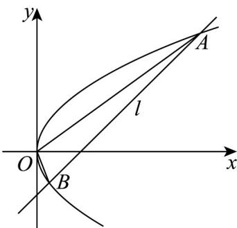

> [!faq]- 《专题3_3_抛物线_高效培优讲义_》官方解析
>
> > [!success]- **【答案】** (1)5 (2) $x + y - 2 = 0$ 或 $x - y - 2 = 0$
>
> > [!note]- **【解析】**
> > （1）因为点 $M(m,4)$ 在抛物线上，所以 4m=16，解得 m=4，故 $\left|MF\right|=4+1=5$
> >
> > (2) 若直线 l 与 x 轴重合，则该直线与抛物线只有一个交点，不合乎题意.
> >
> > 依题意，设直线 l 的方程为 $x = ty + 2$ ，
> >
> > 将直线 l 与抛物线方程联立得 $\left\{\begin{aligned}y^{2}&=4x\\ x&=ty+2\end{aligned}\right.$ 得 $y^{2}-4ty-8=0$
> >
> > 设点 $A(x_{1},y_{1})$ 、 $B(x_{2},y_{2})$ ， $\Delta=16t^{2}+32>0$
> >
> > 由韦达定理可得 $y_{1} + y_{2} = 4t$ ， $y_{1}y_{2} = -8$
> >
> > $$
> > \left| A B \right| = \sqrt {1 + t ^ {2}} \cdot \left| y _ {1} - y _ {2} \right| = \sqrt {1 + t ^ {2}} \cdot \sqrt {\left(y _ {1} + y _ {2}\right) ^ {2} - 4 y _ {1} y _ {2}} = \sqrt {\left(t ^ {2} + 1\right) \left(1 6 t ^ {2} + 3 2\right)} = 4 \sqrt {\left(t ^ {2} + 1\right) \left(t ^ {2} + 2\right)}
> > $$
> >
> > 又因为原点到直线 l 的距离为 $d = \frac{2}{\sqrt{1 + t^{2}}}$
> >
> > 
> >
> > 所以 $S_{\triangle AOB} = \frac{1}{2}|AB| \cdot d = \frac{1}{2} \times 4\sqrt{(1 + t^{2})(t^{2} + 2)} \times \frac{2}{\sqrt{1 + t^{2}}} = 4\sqrt{t^{2} + 2} = 4\sqrt{3}$ ，解得 $t = \pm 1$ ，
> >
> > 故直线 l 的方程为 $x = \pm y + 2$ ，即 $x + y - 2 = 0$ 或 x - y - 2 = 0。
