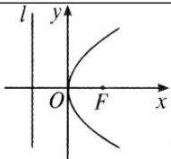
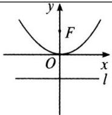
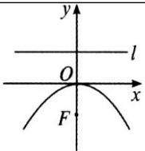
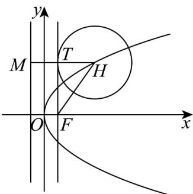
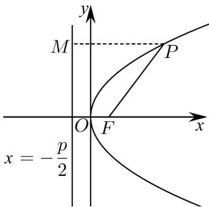

## 知识点 04 抛物线标准方程几何性质的对比

<table><tr><td>图形</td><td></td><td></td><td></td><td></td></tr><tr><td>标准方程</td><td> $y^{2} = 2px(p > 0)$ </td><td> $y^{2} = -2px(p > 0)$ </td><td> $x^{2} = 2py(p > 0)$ </td><td> $x^{2} = -2py(p > 0)$ </td></tr><tr><td>顶点</td><td colspan="4">O(0,0)</td></tr><tr><td>范围</td><td> $x\ 0,\ y \in R$ </td><td> $x \leq 0,\ y \in R$ </td><td> $y\ 0,\ x \in R$ </td><td> $y \leq 0,\ x \in R$ </td></tr><tr><td>对称轴</td><td colspan="2">x轴</td><td colspan="2">y轴</td></tr><tr><td>焦点</td><td> $F\left(\frac{p}{2},0\right)$ </td><td> $F\left(-\frac{p}{2},0\right)$ </td><td> $F\left(0,\frac{p}{2}\right)$ </td><td> $F\left(0,-\frac{p}{2}\right)$ </td></tr><tr><td>离心率</td><td colspan="4">e=1</td></tr><tr><td>准线方程</td><td> $x=-\frac{p}{2}$ </td><td> $x=\frac{p}{2}$ </td><td> $y=-\frac{p}{2}$ </td><td> $y=\frac{p}{2}$ </td></tr><tr><td>焦半径</td><td> $|MF|=x_0+\frac{p}{2}$ </td><td> $|MF|=\frac{p}{2}-x_0$ </td><td> $|MF|=y_0+\frac{p}{2}$ </td><td> $|MF|=\frac{p}{2}-y_0$ </td></tr></table>

【即学即练】

1. 已知抛物线 $C: y^2 = 2px (p > 0)$ 的焦点为 $F$ ， $H(m,4)$ 是抛物线 $C$ 上一点，以点 $H$ 为圆心的圆与直线 $x = \frac{p}{2}$ 相切于点 $T$ 。若 $\sin \angle HFT = \frac{3}{5}$ ，则圆 $H$ 的标准方程为（）A. $(x - 4)^2 + (y - 4)^2 = 9$ B. $(x - 4)^2 + (y - 4)^2 = 16$ C. $(x - 2)^2 + (y - 4)^2 = 4$ D. $(x - 3)^2 + (y - 4)^2 = 9$

【答案】A

【详解】过点 $H$ 作 $HM$ 垂直于直线 $x = -\frac{p}{2}$ ，垂足为 $M$ ，则 $\left|HF\right| = \left|HM\right| = m + \frac{p}{2}$ ， $\left|TH\right| = m - \frac{p}{2}$ ，

因为 $\sin\angle HFT=\frac{3}{5}$ ，所以 $\frac{m-\frac{p}{2}}{m+\frac{p}{2}}=\frac{3}{5}$ ，得 m=2p

因为 $H(m,4)$ 是抛物线 $C$ 上一点，

所以 $2pm = 16$ ，得 $p = 2$ ， $m = 4$

则 $|TH|=3$ ， $H(4,4)$

因为圆 $H$ 与直线 $x = \frac{p}{2} = 1$ 相切，故圆 $H$ 的半径为3，

故圆 $H$ 的标准方程为 $\left(x - 4\right)^2 +\left(y - 4\right)^2 = 9$

故选：A.

2. 已知抛物线 $C: 2x^{2} + my = 0$ 恰好经过圆 $M: (x - 1)^{2} + (y + 2)^{2} = 1$ 的圆心，则 $C$ 的准线方程为（）A. $x = \frac{1}{2}$ B. $x = -\frac{1}{2}$ C. $y = \frac{1}{8}$ D. $y = -\frac{1}{8}$

【答案】C

【详解】圆 $M$ 的圆心为 $M(1, - 2)$

将圆心 $M$ 的坐标代入抛物线的方程得 $2 \times 1^{2} - 2m = 0$ ，解得 $m = 1$

故抛物线 $C$ 的方程为 $2x^{2} + y = 0$ ，标准方程为 $x^{2} = -\frac{1}{2} y$

则 $2p = \frac{1}{2}$ ，所以， $\frac{p}{2} = \frac{1}{8}$ ，故抛物线 $C$ 的准线方程为 $y = \frac{1}{8}$

故选：C.

知识点 05 焦半径公式

设抛物线上一点 $P$ 的坐标为 $(x_0, y_0)$ ，焦点为 $F$ 。

1、抛物线 $y^{2} = 2px (p > 0)$ ， $\left|PF\right| = \left|x_{0} + \frac{p}{2}\right| = x_{0} + \frac{p}{2}$ 。2、抛物线 $y^{2} = -2px (p > 0)$ ， $\left|PF\right| = \left|x_{0} - \frac{p}{2}\right| = -x_{0} + \frac{p}{2}$

3、抛物线 $x^{2} = 2py(p > 0)$ ， $\left|PF\right| = \left|y_0 + \frac{p}{2}\right| = y_0 + \frac{p}{2}$ .4、抛物线 $x^{2} = -2py(p > 0)$ ， $\left|PF\right| = \left|y_0 - \frac{p}{2}\right| = -y_0 + \frac{p}{2}$

【即学即练】

1. 抛物线的焦半径公式

已知抛物线的方程为 $y^{2} = 2px(p > 0), P(x_{0}, y_{0})$ ， $F$ 为抛物线的焦点，则 $|PF| =$

【答案】 $x_{0}+\frac{p}{2}$

【详解】如图所示：

由图及抛物线定义可得焦半径为：

$$
\left| P F \right| = \left| P M \right| = x _ {0} + \frac {p}{2}
$$

故答案为： $x_{0}+\frac{p}{2}$

2．已知抛物线 $C: y^{2} = 2px (p > 0)$ ，过焦点 P 的直线交抛物线 C 于 A，B 两点，且线段 $\left|AB\right|$ 的长是焦半径 $\left|AP\right|$

长的 $^{3}$ 倍，则直线AB的斜率为\_\_\_\_。

【答案】 $\pm 2\sqrt{2}$

【详解】设直线 AB 的倾斜角为 $\theta$ ，则 $\theta \in (0^{\circ}, 180^{\circ})$

因为线段 $\left|AB\right|$ 的长是焦半径 $\left|AP\right|$ 长的3倍，所以 $\left|BP\right|=2\left|AP\right|$ ，故 $\theta\neq90^{\circ}$ ，

当 $\theta \in (0^{\circ},90^{\circ})$ 时， $|AP| = \frac{p}{1 + \cos\theta}$ ， $|BP| = \frac{p}{1 - \cos\theta}$ ，

则 $\frac{|BP|}{|AP|}=\frac{1+\cos\theta}{1-\cos\theta}=2$ ，解得 $\cos\theta=\frac{1}{3}$ ，所以直线 AB 的斜率为 $2\sqrt{2}$

同理可得当 $\theta \in (90^{\circ},180^{\circ})$ 时， $\cos \theta = -\frac{1}{3}$ ，所以直线 $AB$ 的斜率为 $-2\sqrt{2}$ 。

综上，直线 $AB$ 的斜率为 $\pm 2\sqrt{2}$

故答案为： $\pm2\sqrt{2}$
