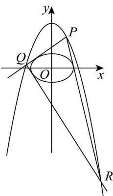

## 知识点 06 直线与抛物线的位置关系

1、直线与抛物线的位置关系有三种情况：相交（有两个公共点或一个公共点）；相切（有一个公共点）；相离（没有公共点）.

2、以抛物线 $y^{2} = 2px (p > 0)$ 与直线的位置关系为例：（1）直线的斜率 $k$ 不存在，设直线方程为 $x = a$ ，若 $a > 0$ ，直线与抛物线有两个交点；

若 $a = 0$ ，直线与抛物线有一个交点，且交点既是原点又是切点；

若 $a < 0$ ，直线与抛物线没有交点.

(2) 直线的斜率 $k$ 存在．设直线 $l: y = kx + b$ ，抛物线 $y^{2} = 2px (p > 0)$

直线与抛物线的交点的个数等于方程组 $\left\{ \begin{array}{l} y = kx + b \\ y^2 = 2px \end{array} \right.$ ，的解的个数，

即二次方程 $k^2 x^2 + 2(kb - p)x + b^2 = 0$ （或 $k^2 y^2 - 2py + 2bp = 0$ ）解的个数。

① 若 $k \neq 0$ ，则当 $\Delta > 0$ 时，直线与抛物线相交，有两个公共点；

当 $\Delta = 0$ 时，直线与抛物线相切，有个公共点；当 $\Delta < 0$ 时，直线与抛物线相离，无公共点。

②若 $k = 0$ ，则直线 $y = b$ 与抛物线 $y^{2} = 2px(p > 0)$ 相交，有一个公共点.

【即学即练】

1. 已知抛物线 $C: x^2 = 2py(p > 0)$ 过点 $M(2\sqrt{3}, 3)$ ，焦点为 $F$ 。

(1)求抛物线 $C$ 的标准方程；

(2)过点 $D(0,t)$ 且斜率为1的直线交抛物线 $C$ 于 $A$ 、 $B$ 两点，若 $F$ 在以 $AB$ 为直径的圆内，求实数 $t$ 的取值范围.

【答案】(1) $x^{2} = 4y$

(2) $\left(3 - 2\sqrt{3}, 3 + 2\sqrt{3}\right)$

【详解】（1）因为点 $M(2\sqrt{3}, 3)$ 在抛物线上，所以 $(2\sqrt{3})^2 = 2p \times 3$ ，解得 $p = 2$ ，所以抛物线 $C$ 的方程为 $x^2 = 4y$

(2) 易知抛物线 $C$ 的焦点为 $F(0,1)$ ，且“点”在以 $AB$ 为直径的圆内等价于“ $FA \cdot FB < 0$ ”。

$$
\text {设} A \left(x _ {1}, y _ {1}\right), B \left(x _ {2}, y _ {2}\right) \quad , \text {则} F A \cdot F B = \left(x _ {1}, y _ {1} - 1\right) \cdot \left(x _ {2}, y _ {2} - 1\right) = x _ {1} x _ {2} + y _ {1} y _ {2} - \left(y _ {1} + y _ {2}\right) + 1, \text {记为①}
$$

由题意，过点 $\left(0,t\right)$ 且斜率为 $1$ 的直线方程为 $y = x + t$ 。于是有 $y_{1} = x_{1} + t$ 和 $y_{2} = x_{2} + t$ ，将其代入①式，得 $FA \cdot FB = 2x_{1}x_{2} + (t - 1)(x_{1} + x_{2}) + t^{2} - 2t + 1$ 。记为②

由 $\left\{\begin{aligned}x^{2}&=4y\\ y&=x+t\end{aligned}\right.$ 联立消去 y ，整理得 $x^{2}-4x-4t=0$ 。于是有 $\Delta=16+16t>0$ ，即 t>-1 且 $\left\{\begin{aligned}x_{1}+x_{2}&=4\\ x_{1}x_{2}&=-4t\end{aligned}\right.$ ，记为③

再将③代入②，整理得

$$
F A \cdot F B = - 8 t + 4 (t - 1) + t ^ {2} - 2 t + 1 = t ^ {2} - 6 t - 3
$$

要 $\overline{FA} \cdot \overline{FB} < 0$ 成立，只要 $t^{2} - 6t - 3 = (t - 3)^{2} - 12 < 0$ 在 $t \in (-1, +\infty)$ 上恒成立即可.

解不等式 $\left(t - 3\right)^2 -12 <   0$ 得 $t\in \left(3 - 2\sqrt{3},3 + 2\sqrt{3}\right)$ ，符合题意.

综上可知，实数 $t$ 的取值范围为 $\left(3 - 2\sqrt{3}, 3 + 2\sqrt{3}\right)$

2. 已知曲线 $C_1: x^2 + y = 3$ 和曲线 $C_2: \frac{x^2}{2} + y^2 = 1$ .

(1)若曲线 $C_1$ 上两个不同点 $A$ 、 $B$ 的横坐标分别为 $x_{1}, x_{2}$ ，求证：直线 $AB$ 的方程： $y = -(x_{1} + x_{2})x + x_{1}x_{2} + 3$

(2)若直线 $l:y = kx + m$ 与曲线 $C_2$ 相切，求证： $m^2 = 2k^2 +1$

(3)若曲线 $C_1$ 上任意点 $P$ 向曲线 $C_2$ 引两条切线交 $C_1$ 于另两点为 $Q, R$ ，求证：直线 $QR$ 与曲线 $C_2$ 相切.

【答案】(1)证明见解析

(2)证明见解析

(3)证明见解析

【详解】（1）设 $A(x_{1},y_{1})$ ， $B(x_{2},y_{2})$ ，因为 A, B 在曲线 $C_{1}:x^{2}+y=3$ 上，所以有：

$y_{1}=3-x_{1}^{2},y_{2}=3-x_{2}^{2}$ ，易知 $x_{1}\neq x_{2}$

所以直线 $AB$ 的斜率 $k_{AB} = \frac{y_2 - y_1}{x_2 - x_1} = \frac{\left(3 - x_2^2\right) - \left(3 - x_1^2\right)}{x_2 - x_1} = \frac{x_1^2 - x_2^2}{x_2 - x_1} = -(x_1 + x_2)$ .

根据点斜式方程，直线 AB 过点 $A(x_{1}, y_{1})$ ，则直线 AB 的方程为 $y - y_{1} = -(x_{1} + x_{2})(x - x_{1})$ .

将 $y_{1} = 3 - x_{1}^{2}$ 代入上式得： $y - \left(3 - x_{1}^{2}\right) = -\left(x_{1} + x_{2}\right)\left(x - x_{1}\right)$

展开可得： $y-3+x_{1}^{2}=-\left(x_{1}+x_{2}\right)x+x_{1}\left(x_{1}+x_{2}\right)$

化简得 $y = -\left(x_{1} + x_{2}\right)x + x_{1}^{2} + x_{1}x_{2} + 3 - x_{1}^{2}$

即 $y = -\left(x_{1} + x_{2}\right)x + x_{1}x_{2} + 3$ ，得证·

(2) 将直线： $y = kx + m$ 代入曲线 $C_{2} : \frac{x^{2}}{2} + y^{2} = 1$ ，可得： $\frac{x^{2}}{2} + (kx + m)^{2} = 1$

展开并整理得： $\left(1 + 2k^2\right)x^2 +4kmx + 2m^2 -2 = 0$

因为直线 l 与曲线 $C_{2}$ 相切，所以此一元二次方程的判别式 $\Delta = 0$ .

则 $\Delta = (4km)^2 - 4(1 + 2k^2)(2m^2 - 2) = 0$

展开得： $16k^{2}m^{2}-4\left(2m^{2}-2+4k^{2}m^{2}-4k^{2}\right)=0$

化简可得 $m^{2}=2k^{2}+1$ ，得证·

(3) 设 P, Q, R 三点横坐标分别为 $\left(x_{1}, y_{1}\right)$ , $\left(x_{2}, y_{2}\right)$ , $\left(x_{3}, y_{3}\right)$

结合（1）可知直线 $PQ$ 的方程： $y = -\left(x_{1} + x_{2}\right)x + x_{1}x_{2} + 3$

直线 PQ 与曲线 $C_{2}$ 相切，再结合（2）中 $m^{2}=2k^{2}+1$ 得： $\left(x_{1}x_{2}+3\right)^{2}=2\left(x_{1}+x_{2}\right)^{2}+1$

整理得： $2x_{1}^{2}+2x_{2}^{2}-x_{1}^{2}x_{2}^{2}-2x_{1}x_{2}-8=0\Leftrightarrow2(3-y_{1})+2(3-y_{2})-(3-y_{1})(3-y_{2})-2x_{1}x_{2}-8=0$

再整理： $2x_{1}x_{2}+y_{1}y_{2}-\left(y_{1}+y_{2}\right)+5=0\Rightarrow2x_{1}x_{2}+\left(y_{1}-1\right)y_{2}-y_{1}+5=0$

同理可得 $2x_{1}x_{3} + (y_{1} - 1)y_{3} - y_{1} + 5 = 0$

所以直线 $2x_{1}x + (y_{1} - 1)y - y_{1} + 5 = 0$ 既过点 $Q(x_{2}, y_{2})$ 又过点 $R(x_{3}, y_{3})$

即直线 QR 的方程： $2x_{1}x + (y_{1} - 1)y - y_{1} + 5 = 0$ .

再次结合 $(2)$ 可推算：

$$
2 k ^ {2} - m ^ {2} + 1 = 2 \left(\frac {2 x _ {1}}{y _ {1} - 1}\right) ^ {2} - \left(\frac {y _ {1} - 5}{y _ {1} - 1}\right) ^ {2} + 1 = \frac {8 x _ {1} ^ {2} - (y _ {1} - 5) ^ {2}}{(y _ {1} - 1) ^ {2}} + 1 = \frac {8 (3 - y _ {1}) - (y _ {1} - 5) ^ {2}}{(y _ {1} - 1) ^ {2}} + 1 = \frac {- y _ {1} ^ {2} + 2 y _ {1} - 1}{(y _ {1} - 1) ^ {2}} + 1 = 0,
$$

所以，直线 QR 与曲线 $C_{2}$ 相切.

