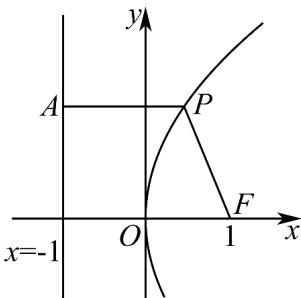

> [!faq]- 《专题3_3_抛物线_高效培优讲义_》官方解析
>
> > [!success]- **【答案】** 4
>
> > [!note]- **【解析】**
> > 抛物线 $y^{2}=4x$ 的焦点 $F(1,0)$ ，准线为 x=-1，
> >
> > 由题意得 $\left|PF\right|=6$ ，结合抛物线定义知 P 点到准线的距离为 6，
> >
> > 
> >
> > 则 $x_{p}=6-1=5$
> >
> > 代入横坐标可得 $y_{p} = \pm 2\sqrt{5}$ ，即 $P(5,\pm 2\sqrt{5})$
> >
> > 所以 $PF$ 的中点坐标为 $(3, \sqrt{5})$ 或 $(3, -\sqrt{5})$
> >
> > $$
> > \left| P F \right| = \sqrt {4 ^ {2} + (2 \sqrt {5}) ^ {2}} = 6
> > $$
> >
> > 所以以 PF 的中点为圆心， $\left|PF\right|$ 长度为直径的圆的方程为 $(x-3)^{2}+\left(y-\sqrt{5}\right)^{2}=9$ 或 $(x-3)^{2}+\left(y+\sqrt{5}\right)^{2}=9$ ，
> > 圆心到 x 轴距离为 $\sqrt{5}$ ，所以与 x 截得的弦长为 $2\sqrt{9-\left(\sqrt{5}\right)^{2}}=4$ ，
> >
> > 故答案为：4.
