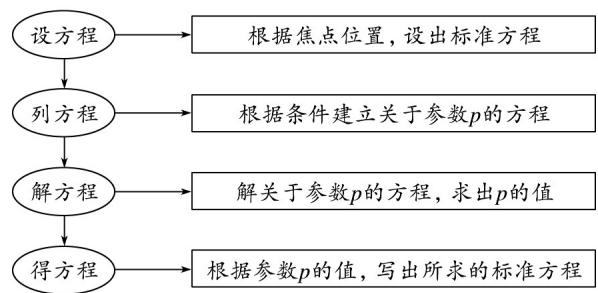

## 题型02 抛物线的标准方程

【典例1】已知抛物线 $y^{2} = 2px (p > 0)$ 的准线方程是 $x = -\frac{1}{2}$ ，直线 $x - y - 2 = 0$ 与抛物线相交于 $M$ 、 $N$ 两点。

(1)求抛物线的方程；

(2)求弦长 $|MN|$ ;

(3)设 O 为坐标原点，证明： $OM \perp ON$

【答案】(1) $y^{2}=2x$ ；

(2) $2\sqrt{10}$ ;

(3)详见解析·

【详解】（1）解：因为抛物线 $y^{2} = 2px (p > 0)$ 的准线方程是 $x = -\frac{1}{2}$

所以 $-\frac{p}{2}=-\frac{1}{2}$ ，解得 p=1，

所以抛物线的方程是 $y^{2}=2x$ ；

(2) 由 $\left\{\begin{aligned}x-y-2&=0\\ y^{2}&=2x\end{aligned}\right.$ ，得 $x^{2}-6x+4=0$ ，

设 $M(x_{1},y_{1}),N(x_{2},y_{2})$

则 $x_{1} + x_{2} = 6, x_{1} \cdot x_{2} = 4$

所以 $\left|MN\right|=\sqrt{2}\sqrt{\left(x_{1}+x_{2}\right)^{2}-4x_{1}\cdot x_{2}}=2\sqrt{10}$

(3) 因为 $OM \cdot ON = x_{1} \cdot x_{2} + y_{1} \cdot y_{2}$

$$
= 2 x _ {1} \cdot x _ {2} - 2 (x _ {1} + x _ {2}) + 4
$$

$$
= 2 \times 4 - 2 \times 6 + 4 = 0
$$

所以 $OM \perp ON$ ，

即 $OM \perp ON$ .

## 方法技巧

## 1、求抛物线的标准方程的方法

<table><tr><td>定义法</td><td>根据定义求p,最后写标准方程</td></tr><tr><td>待定系数法</td><td>设标准方程,列有关的方程组求系数</td></tr><tr><td>直接法</td><td>建立恰当的坐标系,利用抛物线的定义列出动点满足的条件,列出对应方程,化简方程</td></tr></table>

注：当抛物线的焦点位置不确定时，应分类讨论，也可以设 $y2 = ax$ 或 $x2 = ay(a \neq 0)$ 的形式，以简化讨论过程。

2、用待定系数法求抛物线标准方程的步骤

![[高中/课堂同步/题库/人教A版高中数学同步讲义(2026)/03_选择性必修第一册/第三章 圆锥曲线的方程/讲义/专题3_3_抛物线_高效培优讲义_/题型02_抛物线的标准方程_sec_11/questions/Q00063118.md]]
![[高中/课堂同步/题库/人教A版高中数学同步讲义(2026)/03_选择性必修第一册/第三章 圆锥曲线的方程/讲义/专题3_3_抛物线_高效培优讲义_/题型02_抛物线的标准方程_sec_11/questions/Q00063119.md]]
![[高中/课堂同步/题库/人教A版高中数学同步讲义(2026)/03_选择性必修第一册/第三章 圆锥曲线的方程/讲义/专题3_3_抛物线_高效培优讲义_/题型02_抛物线的标准方程_sec_11/questions/Q00063120.md]]
