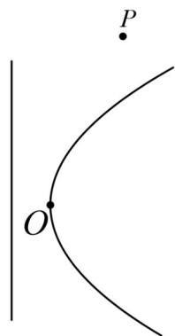

<!-- question-source:start -->
【变式3】如图，弯曲的河流是近似的抛物线 $C$ ，公路 $l$ 恰好是 $C$ 的准线， $C$ 上的点 $O$ 到 $l$ 的距离最近，且为

$0.4\mathrm{km}$ ，城镇 $P$ 位于点 $O$ 的北偏东 $30^{\circ}$ 处， $\left|OP\right| = 10\mathrm{km}$ ，现要在河岸边的某处修建一座码头，并修建两条公路，

一条连接城镇，一条垂直连接公路 $l$ ，以便建立水陆交通网。

(1)建立适当的坐标系，求抛物线 C 的方程；

(2)为了降低修路成本，必须使修建的两条公路总长最小，请给出修建方案（作出图形，在图中标出此时码头

$Q$ 的位置），并求公路总长的最小值（结果精确到 $0.001\mathrm{km}$ ）.
<!-- question-source:end -->

![[高中/课堂同步/题库/人教A版高中数学同步讲义(2026)/03_选择性必修第一册/第三章 圆锥曲线的方程/讲义/专题3_3_抛物线_高效培优讲义_/题型05_抛物线的实际应用_sec_14/questions/answers/Q00063129A1.md]]
