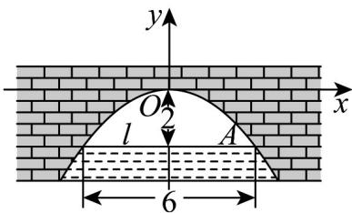

> [!faq]- 《专题3_3_抛物线_高效培优讲义_》官方解析
>
> > [!success]- **【答案】** C
>
> > [!note]- **【解析】**
> > 建立如图所示的平面直角坐标系，则点 $A(3, -2)$ ·设抛物线的方程为 $y = ax^2$
> >
> > 由点 $A(3,-2)$ 可得 -2=9a，解得 $a=-\frac{2}{9}$ ，所以 $y=-\frac{2x^{2}}{9}$
> >
> > 当 $y = -3$ 时， $x = \pm \frac{3\sqrt{6}}{2}$ ，所以水面宽度为 $3\sqrt{6}\mathrm{m}$
> >
> > 故选：C.
> >
> > 
