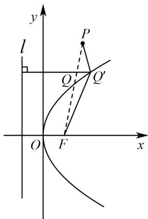

> [!faq]- 《专题3_3_抛物线_高效培优讲义_》官方解析
>
> > [!success]- **【答案】** (1) $y^{2}=1.6x$ (2)作图见解析，9.806km。
>
> > [!note]- **【解析】**
> > （1）如图，建立平面直角坐标系，由题意得， $\frac{p}{2} = 0.4$ ，则抛物线 $C: y^2 = 1.6x$
> >
> > 
> >
> > (2) 如图，设抛物线 C 的焦点为 F，则 $F(0.4,0)$ ，
> >
> > ∵城镇P位于点O的北偏东 $30^{\circ}$ 处， $\left|OP\right|=10km,\therefore P\left(5,5\sqrt{3}\right)$
> >
> > 根据抛物线的定义知，公路总长 $= \left|Q'F\right| + \left|Q'P\right|$ $|PF| = \sqrt{(5 - 0.4)^2 + (5\sqrt{3} - 0)^2}\approx 9.806$
> >
> > 当 $Q'$ 与 $Q$ 重合时（ $Q$ 为线段 $PF$ 与抛物线 $C$ 的交点），公路总长最小，最小值为 $9.806\mathrm{km}$
> >
> > 
> >
> > 题型06 抛物线的简单几何性质
> >
> > 【典例1】已知点 $F$ 为抛物线 $y^{2} = 2px(p > 0)$ 的焦点，直线 $l:y = 2x - 1$ 与该抛物线交于 $A$ ， $B$ 两点，点 $M$ 为
> >
> > $AB$ 的中点，过点 $M$ 向该抛物线的准线作垂线，垂足为 $M_{1}$ 若 $\left|MM_{1}\right| = \frac{11}{4}$ ，则 $p = (\quad)$ A.2 B.3 C.4 D.5
> >
> > 【答案】B
> >
> > 【详解】根据题意，过点 $A, B$ 分别向该抛物线的准线作垂线，垂足分别为 $A_{1}, B_{1}$ ，所以 $\left|AA_{1}\right| + \left|BB_{1}\right| = 2\left|MM_{1}\right| = \frac{11}{2}$ ，所以 $\left|AF\right| + \left|BF\right| = \frac{11}{2}$ ，设 $A(x_{1}, y_{1})$ ， $B(x_{2}, y_{2})$ ，根据定义可得 $\left|AF\right| + \left|BF\right| = x_{1} + \frac{p}{2} + x_{2} + \frac{p}{2} = x_{1} + x_{2} + p$ ，联立 $\left\{y^{2} = 2px, y = 2x - 1\right.$ ，可得 $4x^{2} - (4 + 2p)x + 1 = 0$ ， $\Delta = 4p^{2} + 16p > 0$ ，则 $x_{1} + x_{2} = \frac{2 + p}{2}$ ， $\left|AF\right| + \left|BF\right| = x_{1} + x_{2} + p = \frac{2 + p}{2} + p = \frac{11}{2}$ ，解得 $p = 3$ 。
> >
> > 故选：B.
> >
> > 
> >
> > ## 方法技巧
> >
> > 1、用待定系数法求抛物线方程的步骤根据条件确定抛物线的焦点在哪条坐标轴上及开口方向
> >
> > 
> >
> > 根据焦点和开口方向设出标准方程
> >
> > 根据条件列出关于 $p$ 的方程
> >
> > 解方程, 将 p 代入所设方程即为所求
> >
> > 注：求抛物线的方程时要注意抛物线的焦点位置，不同的焦点设出不同的方程。
> >
> > 2、把握三个要点确定抛物线的简单几何性质
> >
> > (1)开口：由抛物线标准方程看图象开口，关键是看准一次项是 $x$ 还是 $y$ ，一次项的系数是正还是负.
> >
> > (2)关系：顶点位于焦点与准线中间，准线垂直于对称轴.
> >
> > (3)定值：焦点到准线的距离为 $p$ ；过焦点垂直于对称轴的弦(又称为通径)长为 $2p$ ；离心率恒等于1.
> >
> > 3、利用抛物线的性质可以解决的问题
> >
> > (1)对称性：解决抛物线的内接三角形问题.
> >
> > (2)焦点、准线：解决与抛物线的定义有关的问题。
> >
> > (3)范围：解决与抛物线有关的最值问题.
> >
> > (4)焦点弦：解决焦点弦问题。
