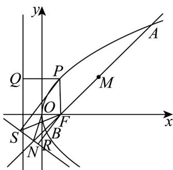

> [!faq]- 《专题3_3_抛物线_高效培优讲义_》官方解析
>
> > [!success]- **【答案】** (1)2 (2) $\frac{5}{7}$ (3)2
>
> > [!note]- **【解析】**
> > （1）由题得 $C$ 的焦点为 $F\left(\frac{p}{2},0\right)$ ，设 $l$ 为 $y = x - \frac{p}{2}$
> >
> > 设 $A(x_{1},y_{1})$ ， $B(x_{2},y_{2})$ ， $M(3,y_{0})$
> >
> > 联立方程 $\left\{ \begin{array}{l} y = x - \frac{p}{2} \\ y^2 = 2px \end{array} \right.$ ，化简得： $x^2 - 3px + \frac{p^2}{4} = 0$ ，
> >
> > $\Delta=9p^{2}-p^{2}>0$ ，则 $x_{1}+x_{2}=3p=6$ ，∴p=2。
> >
> > $^{2}$ 由 $^{1}$ 得 $F(1,0)$
> >
> > 联立方程 $\left\{\begin{aligned}y&=x-1\\ 3x+4y+7&=0\end{aligned}\right.$ ，解得 $N\left(-\frac{3}{7},-\frac{10}{7}\right)$ ， $S_{\triangle OFN}=\frac{1}{2}\times\left|OF\right|\times\left|y_{N}\right|=\frac{5}{7}$
> >
> > (3)
> >
> > 
> >
> > 由（1）得 $C$ 的方程为 $y^{2} = 4x$
> >
> > 由抛物线定义可知，点 P 到准线的距离等于点 P 到焦点 F 的距离，
> >
> > 联立方程 $\left\{ \begin{array}{l} y^{2} = 4x \\ 3x + 4y + 7 = 0 \end{array} \right.$ ，化简得： $\frac{3}{4} y^{2} + 4y + 7 = 0$
> >
> > 由 $\Delta = 16 - 4 \times \frac{3}{4} \times 7 = -5 < 0$ ，得 C 与 $l'$ 相离，
> >
> > 设 $Q$ ，S， $R$ 分别是过点 $P$ 向准线、直线 $l^{\prime}:3x + 4y + 7 = 0$ 以及过点 $F$ 向直线 $l^{\prime}:3x + 4y + 7 = 0$ 引垂线的垂足，连接 $FP$ ，FS，
> >
> > 所以点 $P$ 到 $C$ 的准线的距离与点 $P$ 到直线 $l^{\prime}$ 的距离之和 $\left|PQ\right| + \left|PS\right| = \left|PF\right| + \left|PS\right|$ $\left|FS\right|$ $\left|FR\right|$
> >
> > 当且仅当点 P 为线段 FR 与抛物线的交点时等号成立，
> >
> > 所以 P 到 C 的准线的距离与 $P$ 到 $l'$ 的距离之和的最小值为点 $F(1,0)$ 到直线 $l':3x+4y+7=0$ 的距离，
> > 即 $\left(\left|PQ\right|+\left|PS\right|\right)_{\min}=\left|FR\right|=\frac{\left|3\times1+0+7\right|}{\sqrt{3^{2}+4^{2}}}=2$
