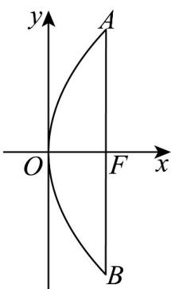

## 题型05 抛物线的实际应用

【典例1】某学习小组研究一种如图 $^{1}$ 所示的卫星接收天线，发现其轴截面为如图 $^{2}$ 所示的抛物线，在轴截面

内的卫星信号波束呈近似平行的状态射入，经反射聚焦到焦点 $F$ 处，已知卫星接收天线的口径（直径）为

10m，深度为 3m，则该卫星接收天线轴截面所在的抛物线焦点到顶点的距离为（）

图1

图2

A. $\frac{5}{3}\mathrm{m}$ B. $\frac{25}{12}\mathrm{m}$ C. $\frac{25}{6}\mathrm{m}$ D. $\frac{5}{4}\mathrm{m}$

【答案】B

【详解】由题意建立如图所示的平面直角坐标系，

设抛物线的方程为 $y^{2}=2px(p>0)$ .

由题意可得 $A(3,5)$ ，将点A的坐标代入抛物线的方程可得 $25 = 6p$

解得 $p = \frac{25}{6}$ ，所以抛物线的方程为 $y^{2} = \frac{25}{3} x$

焦点的坐标为 $(\frac{p}{2}, 0)$ ，即 $(\frac{25}{12}, 0)$

所以抛物线焦点到顶点的距离为 $\frac{25}{12}\mathrm{m}$

故选：B.

## 方法技巧

1、涉及拱桥、隧道的问题，通常需建立适当的平面直角坐标系，利用抛物线的标准方程进行求解。

2、求抛物线实际应用的五个步骤

建立适当的坐标系

设出合适的抛物线标准方程

求出需要求出的量

通过计算求出抛物线的标准方程

还原到实际问题中,从而解决实际问题

![[高中/课堂同步/题库/人教A版高中数学同步讲义(2026)/03_选择性必修第一册/第三章 圆锥曲线的方程/讲义/专题3_3_抛物线_高效培优讲义_/题型05_抛物线的实际应用_sec_14/questions/Q00063127.md]]
![[高中/课堂同步/题库/人教A版高中数学同步讲义(2026)/03_选择性必修第一册/第三章 圆锥曲线的方程/讲义/专题3_3_抛物线_高效培优讲义_/题型05_抛物线的实际应用_sec_14/questions/Q00063128.md]]
![[高中/课堂同步/题库/人教A版高中数学同步讲义(2026)/03_选择性必修第一册/第三章 圆锥曲线的方程/讲义/专题3_3_抛物线_高效培优讲义_/题型05_抛物线的实际应用_sec_14/questions/Q00063129.md]]
![[高中/课堂同步/题库/人教A版高中数学同步讲义(2026)/03_选择性必修第一册/第三章 圆锥曲线的方程/讲义/专题3_3_抛物线_高效培优讲义_/题型05_抛物线的实际应用_sec_14/questions/Q00063130.md]]
![[高中/课堂同步/题库/人教A版高中数学同步讲义(2026)/03_选择性必修第一册/第三章 圆锥曲线的方程/讲义/专题3_3_抛物线_高效培优讲义_/题型05_抛物线的实际应用_sec_14/questions/Q00063131.md]]
![[高中/课堂同步/题库/人教A版高中数学同步讲义(2026)/03_选择性必修第一册/第三章 圆锥曲线的方程/讲义/专题3_3_抛物线_高效培优讲义_/题型05_抛物线的实际应用_sec_14/questions/Q00063132.md]]
