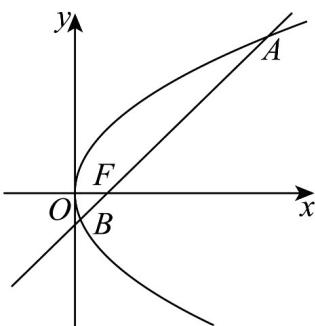

> [!faq]- 《专题3_3_抛物线_高效培优讲义_》官方解析
>
> > [!success]- **【答案】** D
>
> > [!note]- **【解析】**
> > 抛物线 $y^{2}=4x$ 的焦点为 $F(1,0)$
> >
> > 直线 AB 的方程为 y = x - 1，
> >
> > 由 $\left\{ \begin{array}{l} y = x - 1 \\ y^2 = 4x \end{array} \right.$ ，解得 $y_A = 2 + 2\sqrt{2}, y_B = 2 - 2\sqrt{2}$
> >
> > 所以 $\frac{|AF|}{|FB|}=\left|\frac{2+2\sqrt{2}}{2-2\sqrt{2}}\right|=3+2\sqrt{2}$
> >
> > 故选：D
> >
> > 
