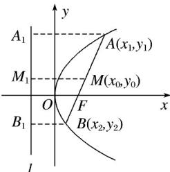

## 题型8 焦点弦问题

【典例1】已知抛物线 $C: x^{2} = 2py(p > 0)$ 的焦点为 $F$ ，动点 $P$ 在抛物线 $C$ 上， $\left|PF\right|$ 的最小值为4.若直线 $AB$ 过点 $F$ 交抛物线 $C$ 于 $A, B$ 两点，弦 $AB$ 的中点为 $G$ ，现分别过点 $A, B$ 作抛物线的两条切线，两条切线交于点 $M$ ，下列说法正确的是（）
A. $p = 4$ B. 若 $\left|AB\right| = 18$ ，则点 $G$ 的纵坐标为5
C. 若线段 $MG$ 的中点为 $H$ ，则点 $H$ 的轨迹是抛物线
D. $\triangle AMB$ 底边 $AB$ 上的高线恒过定点

【答案】BCD

【详解】设 $A(x_{1},y_{1})$ ， $B(x_{2},y_{2})$

对于选项 A :

因为 $\left|PF\right|$ 的最小值为 $^{4}$ ，所以 $\frac{p}{2}=4$ ，解得p=8

则抛物线 C 的标准方程为 $x^{2}=16y$ ，故选项 A 错误.

对于选项 B :

因为 $\left|AB\right|=y_{1}+y_{2}+8=18$ ，所以 $y_{1}+y_{2}=10=2y_{G}$ ，

所以 $y_{G} = 5$ ，故选项B正确；

对于选项 C :

因为切线 $l_{1}: x_{1}x = p\left(y + \frac{x_{1}^{2}}{2p}\right)$ ， $l_{2}: x_{2}x = p\left(y + \frac{x_{2}^{2}}{2p}\right)$ ，

所以 $\frac{x_1}{x_2} = \frac{y + \frac{x_1^2}{2p}}{y + \frac{x_2^2}{2p}}$ ，即 $2p(x_1 - x_2)y = x_1x_2(x_1 - x_2)$ ，解得 $y = \frac{x_1x_2}{2p}$ ，

因为弦 $AB$ 的中点为 $G$ ，所以 $x = \frac{x_1 + x_2}{2}$

即 $M\left(\frac{x_1 + x_2}{2}, \frac{x_1x_2}{16}\right)$

因为 $x_{G} = \frac{x_{1} + x_{2}}{2}$ ， $y_{G} = \frac{\frac{x_{1}^{2}}{16} + \frac{x_{2}^{2}}{16}}{2} = \frac{x_{1}^{2} + x_{2}^{2}}{32}$ ，所以 $H\left(\frac{x_1 + x_2}{2},\frac{(x_1 + x_2)^2}{64}\right)$

因为点 $H$ 在抛物线 $x^{2} = 16y$ 上，

所以点 H 的轨迹是抛物线，故选项 C 正确；

对于选项 D：因为 $k_{AB}=\frac{y_{1}-y_{2}}{x_{1}-x_{2}}=\frac{x_{1}+x_{2}}{16}=\frac{x_{M}}{8}$ ，所以底边 AB 上的高所在直线斜率 $k=-\frac{8}{x_{M}}$

所以高线所在直线方程为 $y + 4 = -\frac{8}{x_M}\left(x - x_M\right)$ ，即 $y = -\frac{8}{x_M} x + 4$

此时直线恒过定点 $(0,4)$ ，故选项D正确。

故选：BCD.

## 方法技巧

过抛物线 $y2 = 2px(p > 0)$ 的焦点的直线交抛物线于 $A(x1, y1)$ ， $B(x2, y2)$ 两点，那么线段 AB 叫做焦点弦，

如图：设 AB 是过抛物线 $y2 = 2px (p > 0)$ 焦点 F 的弦，若 A(x1, y1)，B(x2, y2)，则 $|AB| = x1 + x2 + p$ .

注：(1) $x1\cdot x2=.$ (2) $y1\cdot y2=-p2.(3)\left|AB\right|=x1+x2+p=(a是直线AB的倾斜角)$

(4) + = 为定值(F 是抛物线的焦点).

(5) 求弦长问题的方法

①一般弦长： $|AB|=|x1-x2|$ ，或 $|AB|=|y1-y2|$ .

②焦点弦长：设过焦点的弦的端点为 A(x1, y1)，B(x2, y2)，则 $\left|AB\right|=x1+x2+p.$

![[高中/课堂同步/题库/人教A版高中数学同步讲义(2026)/03_选择性必修第一册/第三章 圆锥曲线的方程/讲义/专题3_3_抛物线_高效培优讲义_/题型8_焦点弦问题_sec_16/questions/Q00063136.md]]
![[高中/课堂同步/题库/人教A版高中数学同步讲义(2026)/03_选择性必修第一册/第三章 圆锥曲线的方程/讲义/专题3_3_抛物线_高效培优讲义_/题型8_焦点弦问题_sec_16/questions/Q00063137.md]]
![[高中/课堂同步/题库/人教A版高中数学同步讲义(2026)/03_选择性必修第一册/第三章 圆锥曲线的方程/讲义/专题3_3_抛物线_高效培优讲义_/题型8_焦点弦问题_sec_16/questions/Q00063138.md]]
