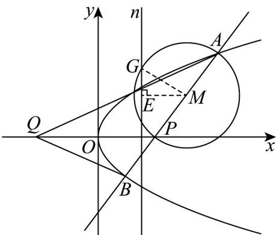

> [!faq]- 《专题3_3_抛物线_高效培优讲义_》官方解析
>
> > [!success]- **【答案】** (1) $y^{2}=4x$ ，曲线C是抛物线 (2)①32；②存在，x=3
>
> > [!note]- **【解析】**
> > （1）由题意，点 $M$ 到定点 $F(10)$ 的距离与它到定直线 $l: x = -1$ 的距离相等，
> >
> > 由抛物线的定义知，点 $M$ 的轨迹是以点 $F$ 为焦点，直线 $l$ 为准线的抛物线，
> >
> > 即曲线 $C$ 是抛物线·由题意知，抛物线 $C$ 开口向右，且 $\frac{p}{2} = 1$ ，所以 $p = 2$
> >
> > 所以抛物线 C 的标准方程为 $y^{2}=4x$ .
> >
> > (2) ①设 $A(x_{1}, y_{1}), B(x_{2}, y_{2})$ .
> >
> > 由题意知，直线 AB 的倾斜角不为 $^{0}$ ，设直线 AB 的方程为 $x = my + 4$ .
> >
> > 由 $\left\{\begin{aligned}x&=my+4\\ y^{2}&=4x\end{aligned}\right.$ ，消去 x，化简得 $y^{2}-4my-16=0$
> >
> > $\Delta = 16(m^2 +4) > 0$ ，则 $y_{1} + y_{2} = 4m,y_{1}y_{2} = -16$
> >
> > 所以 $y_{1}-y_{2}=\sqrt{\left(y_{1}+y_{2}\right)^{2}-4y_{1}y_{2}}=4\sqrt{m^{2}+4}$
> >
> > 因为 $S = \frac{1}{2}\left|PQ\right|\cdot \left(y_{1} - y_{2}\right) = \frac{1}{2}\times 8\times 4\sqrt{m^{2} + 4} = 16\sqrt{m^{2} + 4}$ 32
> >
> > 当且仅当 m=0 时等号成立，所以 $\triangle AQB$ 的面积 S 的最小值是 32.
> > - **②**：假设存在直线 $n: x = t$ 满足题意·设以 $AP$ 为直径的圆为圆 $M$ ，则 $M\left(\frac{x_1 + 4}{2}, \frac{y_1}{2}\right)$
> >
> > 如图，过点 $M$ 作 $ME \perp n$ ，垂足为 $E$ .
> >
> > 
> >
> > 设圆 M 与直线 n 的一个交点为 G，连接 MG，则 $\left|EG\right|^{2}=\left|MG\right|^{2}-\left|ME\right|^{2}$
> >
> > 又 $\left|MG\right|=\left|MA\right|$ ，所以 $\left|EG\right|^{2}=\left|MA\right|^{2}-\left|ME\right|^{2}=\frac{\left(x_{1}-4\right)^{2}+y_{1}^{2}}{4}-\left(\frac{x_{1}+4}{2}-t\right)^{2}$
> >
> > $$
> > = \frac {1}{4} y _ {1} ^ {2} + \frac {\left(x _ {1} - 4\right) ^ {2} - \left(x _ {1} + 4\right) ^ {2}}{4} + t (x _ {1} + 4) - t ^ {2} = x _ {1} - 4 x _ {1} + t (x _ {1} + 4) - t ^ {2}
> > $$
> >
> > $$
> > = (t - 3) x _ {1} + 4 t - t ^ {2}.
> > $$
> >
> > 当 $t = 3$ 时， $\left|EG\right|^2 = 3$
> >
> > 此时直线 $n$ 被以 $AP$ 为直径的圆截得的弦长为定值 $2\sqrt{3}$
> >
> > 因此存在直线 n:x=3 满足题意
