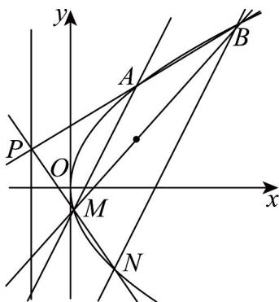

## 题型9 抛物线的定点、定值问题

【典例1】已知点 $P(-1,1)$ 在抛物线 $C:y^{2} = 2px(p > 0)$ 的准线上.

(1)求抛物线 C 的方程；

(2)过点 $P$ 作直线 $l$ 与抛物线交于A、 $B$ 两点，过A作斜率为 $^2$ 的直线交抛物线于 $M$ ：

(i) 求证：直线 $BM$ 过定点；

(ii) 直线 $PM$ 与抛物线 $C$ 交于另外一点 $N$ ，求证： $BN \parallel AM$ 。

【答案】(1) $y^{2}=4x$

(2) (i) 证明见解析；(ii) 证明见解析

【详解】（1）抛物线 $C:y^{2} = 2px(p > 0)$ 的准线为 $x = -\frac{p}{2}$ ，则 $-1 = -\frac{p}{2}$ ，解得 $p = 2$

所以抛物线 C 的方程为 $y^{2}=4x$ .

(2) (i) 设点 $A(x_{1}, y_{1}), B(x_{2}, y_{2})$ ，由点 A, B 在抛物线 $C: y^{2} = 4x$ 上，

得直线 AB 的斜率 $k_{AB}=\frac{y_{2}-y_{1}}{x_{2}-x_{1}}=\frac{y_{2}-y_{1}}{\frac{1}{4}(y_{2}^{2}-y_{1}^{2})}=\frac{4}{y_{2}+y_{1}}$

则直线 $AB$ 的方程为： $y - y_{1} = \frac{4}{y_{1} + y_{2}} (x - x_{1})$ ，即 $y = \frac{4x}{y_1 + y_2} +\frac{y_1y_2}{y_1 + y_2}$

由直线 $AB$ 过点 $P(-1,1)$ ，得 $y_{1}y_{2} = y_{1} + y_{2} + 4$ ，设 $M(x_{3},y_{3}), N(x_{4},y_{4})$

则直线 $AM$ 斜率 $k_{AM} = \frac{4}{y_1 + y_3} = 2$ ，即 $y_{1} + y_{3} = 2$ ， $y_{1} = 2 - y_{3}$

于是 $(2 - y_{3})y_{2} = 2 - y_{3} + y_{2} + 4$ ，即 $y_{2}y_{3} = y_{2} + y_{3} - 6$ ， $\frac{y_2y_3}{y_2 + y_3} = 1 - \frac{6}{y_2 + y_3}$

又直线 $BM$ 的方程为： $y = \frac{4x}{y_2 + y_3} +\frac{y_2y_3}{y_2 + y_3}$ ，即 $y = \frac{4}{y_2 + y_3} (x - \frac{3}{2}) + 1$

所以直线 $_{BM}$ 恒过定点 $\left(\frac{3}{2},1\right)$

(ii) 由直线 $MN$ 过点 $P(-1,1)$ ，得 $y_{3}y_{1} = y_{3} + y_{4} + 4$ ，则 $y_{3} = \frac{y_{1} + 4}{y_{4} - 1}$

而 $y_{1} = \frac{y_{2} + 4}{y_{2} - 1},$ 于是 $\frac{y_2 + 4}{y_2 - 1} +\frac{y_4 + 4}{y_4 - 1} = 2$ ，化简得 $y_{2} + y_{4} = 2$

则直线 BN 的斜率 $k_{BN} = \frac{4}{y_{2} + y_{4}} = 2 = k_{AM}$ ，所以 AM // BN ·

## 方法技巧

① 抛物线中 $p$ 的几何意义② 直线的点斜式方程，斜截式方程③ 抛物线中的弦长公式，一般圆锥曲线的弦长公式

![[高中/课堂同步/题库/人教A版高中数学同步讲义(2026)/03_选择性必修第一册/第三章 圆锥曲线的方程/讲义/专题3_3_抛物线_高效培优讲义_/题型9_抛物线的定点_定值问题_sec_17/questions/Q00063139.md]]
![[高中/课堂同步/题库/人教A版高中数学同步讲义(2026)/03_选择性必修第一册/第三章 圆锥曲线的方程/讲义/专题3_3_抛物线_高效培优讲义_/题型9_抛物线的定点_定值问题_sec_17/questions/Q00063140.md]]
![[高中/课堂同步/题库/人教A版高中数学同步讲义(2026)/03_选择性必修第一册/第三章 圆锥曲线的方程/讲义/专题3_3_抛物线_高效培优讲义_/题型9_抛物线的定点_定值问题_sec_17/questions/Q00063141.md]]
