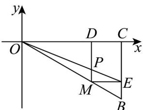

<!-- question-source:start -->
【变式3】如图，已知点 $B(2, -1)$ ， $BC \perp x$ 轴于点 $C$ ， $M$ 是线段 $OB$ 上任意一点， $MD \perp x$ 轴于点 $D$ ，

$ME \perp BC$ 于点 E . OE 与 MD 相交于点 P ，则 P 的轨迹方程为（）.

A $y^{2} = x(0\leq x\leq 2)$

B $y^{2}=\frac{1}{2}x(0\leq x\leq2)$

C $x^{2} = -y(0\leq x\leq 2)$

$$
x ^ {2} = - 4 y (0 \leq x \leq 2)
$$
<!-- question-source:end -->

![[高中/课堂同步/题库/人教A版高中数学同步讲义(2026)/03_选择性必修第一册/第三章 圆锥曲线的方程/讲义/专题3_3_抛物线_高效培优讲义_/题型_03_轨迹方程_抛物线_sec_12/questions/answers/Q00063123A1.md]]
