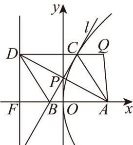

## 题型 03 轨迹方程—抛物线

【典例1】在平面直角坐标系 $xOy$ 中， $A(1,0)$ ， $P$ 为 $y$ 轴上一点，经过 $P$ 的直线 $l$ 与 $PA$ 垂直且与 $x$ 轴交于 $B$ 点，

$^{B}$ 关于 $^{P}$ 的对称点为 C．E 为一曲线，若对于任意固定点 $Q\in E$ ， $|QA|+|AC|+|CQ|$ 的最小值总为 3，则 E 的方

程为：\_\_\_\_。

【答案】 $\left\{\begin{aligned}(x-1)^{2}+y^{2}&=\frac{9}{4},x\leq\frac{1}{2}\\ y^{2}&=3-2x,x>\frac{1}{2}\end{aligned}\right.$

【详解】延长 $AP$ 到 $D$ 使 $\left|AP\right| = \left|DP\right|$ ，由 $\left|PB\right| = \left|PC\right|$ ，得四边形 $DCAB$ 为平行四边形，又 $BC \perp AD$ ，则 $\neg DCAB$ 为菱形，过 $D$ 作 $DF \perp x$ 轴，垂足为 $F$ ，直线 $DF: x = -1$ ，则 $\left|OF\right| = \left|OA\right| = 1$ ，又 $\left|CD\right| = \left|CA\right|$ ， $CD \perp DF$ ，于是 $C$ 的轨迹为抛物线： $y^2 = 4x$ ，① $Q$ 在 $y^2 = 4x$ 内部，过 $Q$ 作 $QN \perp y$ 轴交 $x = -1$ 于点 $N$ ，而 $CD \perp y$ 轴， $|CD| = |CA|$ ， $|QA|$ 为定值，则当 $Q, C, D$ 共线时， $\left|CA\right| + \left|AQ\right| + \left|QC\right|$ 有最小值 $|QA| + |QD| = 3$ 设 $Q(x, y)$ ， $\sqrt{(x - 1)^2 + y^2} + |x + 1| = 3$ ，而 $y^2 < 4x$ ，整理得 $y^2 = 3 - 2x (x > \frac{1}{2})$ ；

② $Q$ 在 $y^{2} = 4x$ 及外部，当 $Q, C, A$ 共线时， $\left|CA\right| + \left|AQ\right| + \left|QC\right|$ 有最小值3，即 $2\left|QA\right| = 3$

设 $Q(x,y)$ ，则 $\sqrt{(x - 1)^2 + y^2} = \frac{3}{2}$ ，而 $y^{2}$ 4x，整理得 $(x - 1)^{2} + y^{2} = \frac{9}{4} (x\leq \frac{1}{2})$

所以曲线 的方程为： $\left\{ \begin{array}{l} (x - 1)^2 + y^2 = \frac{9}{4}, x \leqslant \frac{1}{2} \\ y^2 = 3 - 2x, x > \frac{1}{2} \end{array} \right.$

故答案为： $\left\{ \begin{array}{l}(x - 1)^2 +y^2 = \frac{9}{4},x\leq \frac{1}{2}\\ y^2 = 3 - 2x,x > \frac{1}{2} \end{array} \right.$

## 方法技巧

求轨迹问题的两种方法

(1)直接法：按照动点适合条件直接代入求方程.

(2)定义法：若动点满足某种曲线定义，可按待定系数法列方程(组)求解曲线方程.

![[高中/课堂同步/题库/人教A版高中数学同步讲义(2026)/03_选择性必修第一册/第三章 圆锥曲线的方程/讲义/专题3_3_抛物线_高效培优讲义_/题型_03_轨迹方程_抛物线_sec_12/questions/Q00063121.md]]
![[高中/课堂同步/题库/人教A版高中数学同步讲义(2026)/03_选择性必修第一册/第三章 圆锥曲线的方程/讲义/专题3_3_抛物线_高效培优讲义_/题型_03_轨迹方程_抛物线_sec_12/questions/Q00063122.md]]
![[高中/课堂同步/题库/人教A版高中数学同步讲义(2026)/03_选择性必修第一册/第三章 圆锥曲线的方程/讲义/专题3_3_抛物线_高效培优讲义_/题型_03_轨迹方程_抛物线_sec_12/questions/Q00063123.md]]
