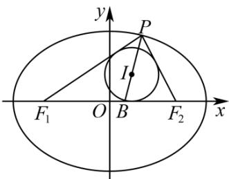

<!-- question-source:start -->
2．如图，已知椭圆 $C:\frac{x^{2}}{a^{2}}+\frac{y^{2}}{b^{2}}=1(a>b>0)$ 的左、右焦点分别为 $F_{1}$ ， $F_{2}$ ，P 是椭圆上的点， $\triangle PF_{1}F_{2}$ 的内切圆

的圆心为 $I$ ，延长 $PI$ ，交 $x$ 轴于点 $B$ ，若 $\frac{|PI|}{|IB|} = 2$ ，则椭圆的离心率等于（）

A. $\frac{1}{3}$ B. $\frac{1}{2}$ C. $\frac{1}{4}$ D. $\frac{1}{5}$
<!-- question-source:end -->

![[高中/课堂同步/题库/人教A版高中数学同步讲义(2026)/03_选择性必修第一册/第三章 圆锥曲线的方程/讲义/第三章_圆锥曲线的方程_高效培优讲义_/即学即练_sec_03/questions/answers/Q00063192A1.md]]
