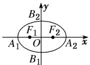
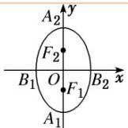

> [!faq]- 《第三章_圆锥曲线的方程_高效培优讲义_》官方解析
>
> > [!success]- **【答案】** B
>
> > [!note]- **【解析】**
> > 椭圆 $C: \frac{x^2}{49} + \frac{y^2}{24} = 1$ 的长轴长 $2a = 14$ ，焦距 $2c = 2\sqrt{49 - 24} = 10$
> >
> > 则 $\left|PF_{1}\right|+\left|PF_{2}\right|=2a=14$ ，由 $PF_{1}\perp PF_{2}$ ，得 $\left|PF_{1}\right|^{2}+\left|PF_{2}\right|^{2}=(2c)^{2}=100$ ，
> >
> > 则 $\left|PF_{1}\right|\left|PF_{2}\right|=48$ ，设 $\triangle PF_{1}F_{2}$ 内切圆半径为r，由 $S_{\triangle PF_{1}F_{2}}=\frac{1}{2}(2a+2c)r=\frac{1}{2}\left|PF_{1}\right|\left|PF_{2}\right|$ ，
> >
> > 得 $(14 + 10)r = 48$ ，所以 $r = 2$
> >
> > 故选：B
> >
> > 
> >
> > 知识点 02 椭圆的方程及简单几何性质
> >
> > <table><tr><td>焦点的位置</td><td>焦点在x轴上</td><td>焦点在y轴上</td></tr><tr><td>图形</td><td></td><td></td></tr><tr><td>标准方程</td><td>+ = 1(a &gt; b &gt; 0)</td><td>+ = 1(a &gt; b &gt; 0)</td></tr><tr><td>范围</td><td>- a≤x≤a且 - b≤y≤b</td><td>- b≤x≤b且 - a≤y≤a</td></tr><tr><td>顶点</td><td>A1(-a,0), A2(a,0), B1(0, -b), B2(0, b)</td><td>A1(0, -a), A2(0, a), B1(-b,0), B2(b,0)</td></tr><tr><td>轴长</td><td colspan="2">长轴长=,短轴长=</td></tr><tr><td>焦点</td><td>F1(-c,0), F2(c,0)</td><td>F1(0, -c), F2(0, c)</td></tr><tr><td>焦距</td><td colspan="2">|F1F2|=</td></tr><tr><td>对称性</td><td colspan="2">对称轴x轴和y轴,对称中心(0,0)</td></tr><tr><td>离心率</td><td colspan="2">e=(0&lt; e&lt;1)(注:e= = .)</td></tr></table>
> >
> > 【即学即练】
