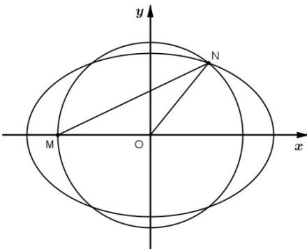

> [!faq]- 《第三章_圆锥曲线的方程_高效培优讲义_》官方解析
>
> > [!success]- **【答案】** C
>
> > [!note]- **【解析】**
> > 由题设 $\triangle MON$ 是底角为 $30^{\circ}$ ，腰长为 3 的等腰三角形，得 $\angle NOx = 60^{\circ}$ 所以 $N\left(\frac{3}{2}, \frac{3}{2} \sqrt{3}\right)$ ，代入椭圆得 $\frac{9}{4a^{2}} + \frac{27}{4(a^{2} - 9)} = 1$ ，可得 $4a^{4} - 72a^{2} + 81 = 0$ ，由 $a > 3$ ，则 $a^{2} = \frac{18 + 9\sqrt{3}}{2}$ ，可得 $a^{2} = \frac{36 + 18\sqrt{3}}{4} = \frac{(3\sqrt{3} + 3)^{2}}{4}$ ，即 $a = \frac{3(\sqrt{3} + 1)}{2}$ .
> >
> > 故选：C
> >
> > 
