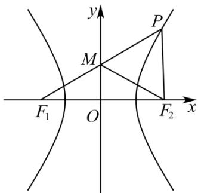

> [!faq]- 《第三章_圆锥曲线的方程_高效培优讲义_》官方解析
>
> > [!success]- **【答案】** A
>
> > [!note]- **【解析】**
> > 如图，由 $\left|PM\right|=\left|MF_{1}\right|$ ，可得M为 $PF_{1}$ 的中点，又O为 $F_{1}F_{2}$ 的中点，得 $OM//PF_{2}$
> >
> > $\angle PF_{2}F_{1}=90^{\circ}$ ， $\angle PF_{1}F_{2}=30^{\circ}$ ， $\left|MF_{2}\right|=\frac{1}{2}\left|PF_{1}\right|$ ，故A错误，B正确。
> >
> > 
> >
> > $$
> > \text {设} \left| F _ {1} F _ {2} \right| = 2 c. \left| P F _ {1} \right| = \frac {2 c}{\cos 3 0 ^ {\circ}} = \frac {4 \sqrt {3}}{3} c, \left| P F _ {2} \right| = 2 c \tan 3 0 ^ {\circ} = \frac {2 \sqrt {3}}{3} c
> > $$
> >
> > 从而 $2a = \left|PF_{1}\right| - \left|PF_{2}\right| = \frac{2\sqrt{3}}{3} c$ ，得 $e = \frac{c}{a} = \sqrt{3}$ ， $\frac{b}{a} = \sqrt{\frac{c^2}{a^2} - 1} = \sqrt{2}$
> >
> > 则渐近线方程为 $y = \pm \frac{b}{a} x = \pm \sqrt{2} x$ ，故C，D正确。
> >
> > 故选 **A**.
