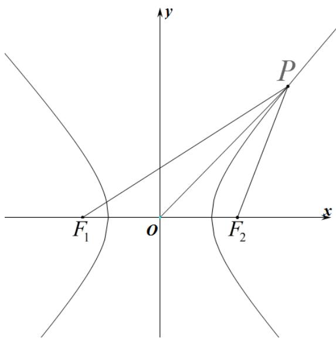

> [!faq]- 《第三章_圆锥曲线的方程_高效培优讲义_》官方解析
>
> > [!success]- **【答案】** A
>
> > [!note]- **【解析】**
> > 由题意得 $\left|F_{1}F_{2}\right|=6,\quad\left|\left|PF_{1}\right|-\left|PF_{2}\right|\right|=2a=4$ ，所以 $\left|PF_{1}\right|^{2}+\left|PF_{2}\right|^{2}-2\left|PF_{1}\right|\left|PF_{2}\right|=16$ ①，
> > 在 $\triangle F_{1}PF_{2}$ 中，由余弦定理得 $\left|PF_{1}\right|^{2}+\left|PF_{2}\right|^{2}-2\left|PF_{1}\right|\left|PF_{2}\right|\cos\angle F_{1}PF_{2}=\left|F_{1}F_{2}\right|^{2}$ 即 $\left|PF_{1}\right|^{2}+\left|PF_{2}\right|^{2}-\frac{1}{3}\left|PF_{1}\right|\left|PF_{2}\right|=36$ ②，联立①②，解得 $\left|PF_{1}\right|^{2}+\left|PF_{2}\right|^{2}=40$ 因为 $\cos\angle POF_{1}+\cos\angle POF_{2}=0$
> >
> > 所以在 $\triangle POF_{1}$ 和 $\triangle POF_{2}$ 中，由余弦定理，得 $\frac{|OP|^2 + |OF_1|^2 - |PF_1|^2}{2|OP||OF_1|} +\frac{|OP|^2 + |OF_2|^2 - |PF_2|^2}{2|OP||OF_2|} = 0$
> >
> > 结合 $\left|F_1F_2\right| = 2\left|OF_1\right| = 2\left|OF_2\right|$ ，可得 $\frac{2\left|OP\right|^2 + 2\left|OF_1\right|^2 - \left(\left|PF_1\right|^2 + \left|PF_2\right|^2\right)}{2\left|OP\right|\left|OF_1\right|} = 0$
> >
> > 所以 $2\left|OP\right|^2 + 2\left|OF_1\right|^2 - \left(\left|PF_1\right|^2 + \left|PF_2\right|^2\right) = 0$
> >
> > 所以 $4|OP|^{2}+4\left|OF_{1}\right|^{2}=2\left(\left|PF_{1}\right|^{2}+\left|PF_{2}\right|^{2}\right)=80$
> >
> > 所以 $4\left|OP\right|^2 +(2\left|OF_1\right|^2 = 80$ ，得 $4\left|OP\right|^2 +(F_1F_2|^2 = 80$
> >
> > 所以 $4|OP|^2 + 36 = 80$
> >
> > 所以 $\left|OP\right|^{2}=11$ ，解得 $\left|OP\right|=\sqrt{11}$
> >
> > 故选：A
> >
> > 
