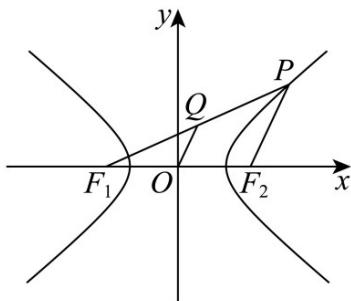

> [!faq]- 《第三章_圆锥曲线的方程_高效培优讲义_》官方解析
>
> > [!success]- **【答案】** C
>
> > [!note]- **【解析】**
> > 由双曲线 $C:\frac{x^{2}}{4}-y^{2}=1$ ，则 a=2，由于 O 为 $F_{1}F_{2}$ 的中点，Q 为线段 $PF_{1}$ 的中点，且 $|OQ|=1$ ，
> > 所以 $\left|PF_{2}\right|=2$ ，则 $\left|PF_{1}\right|=\left|PF_{2}\right|+2a=2+4=6$
> >
> > 故选：C.
> >
> > 
