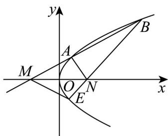

<!-- question-source:start -->
2．如图，过点 $M(-1,0)$ 的直线交抛物线 $C:y^{2} = 2x$ 于 $A,B$ 两点，点 $A$ 在 $M,B$ 之间，点 $N$ 与点 $M$ 关于原点

对称，连接 $BN$ 并延长交抛物线 $C$ 于 $E$ ，记直线 $AN$ 的斜率为 $k_{1}$ ，直线 $ME$ 的斜率为 $k_{2}$ ，当 $k_{1} = 3k_{2}$ 时， $\triangle ABN$

的面积为（）

A.1 B. $\sqrt{2}$ C. $\sqrt{3}$ D.2
<!-- question-source:end -->

![[高中/课堂同步/题库/人教A版高中数学同步讲义(2026)/03_选择性必修第一册/第三章 圆锥曲线的方程/讲义/第三章_圆锥曲线的方程_高效培优讲义_/即学即练_sec_12/questions/answers/Q00063199A1.md]]
