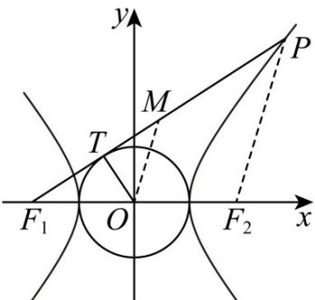

> [!faq]- 《第三章_圆锥曲线的方程_高效培优讲义_》官方解析
>
> > [!success]- **【答案】** A
>
> > [!note]- **【解析】**
> > 如图，连接 $MO$ ， $PF_{2}$ ，因为 $M$ 为 $F_{1}P$ 的中点， $O$ 为 $F_{1}F_{2}$ 的中点，
> >
> > 所以 $\left|MF_1\right| = \frac{1}{2}\left|PF_1\right|,\left|MO\right| = \frac{1}{2}\left|PF_2\right|$
> >
> > 所以 $\left|MF_{1}\right|-\left|MO\right|=\frac{1}{2}\left(\left|PF_{1}\right|-\left|PF_{2}\right|\right)=a$
> >
> > 因为 $\left|TF_1\right| = \sqrt{\left|OF_1\right|^2 - \left|OT\right|^2} = \sqrt{c^2 - a^2} = b$
> >
> > 所以 $\left|MF_1\right| = \left|M T\right| + \left|TF_1\right| = \left|M T\right| + b$
> >
> > 所以 $\left|MT\right|+b-\left|MO\right|=a$ ，即 $\left|MO\right|-\left|MT\right|=b-a$
> >
> > 故选：A.
> >
> > 
