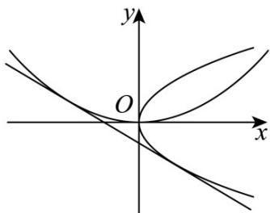

> [!faq]- 《第三章_圆锥曲线的方程_高效培优讲义_》官方解析
>
> > [!success]- **【答案】** (1) $y = -x - \frac{1}{2}$ (2) $^{k}$ 与 $^{b}$ 互为倒数.
>
> > [!note]- **【解析】**
> > （1）由题意可知，直线 $l$ 的斜率存在且不为0，设直线 $l$ 的方程为 $y = tx + m$
> >
> > 联立 $\left\{\begin{aligned}x^{2}&=2y,\\ y&=tx+m,\end{aligned}\right.$ 消去 y 并整理得 $x^{2}-2tx-2m=0$
> >
> > 因为直线 $l$ 与抛物线 $C_1$ 相切，所以 $\Delta_1 = (-2t)^2 - 4(-2m) = 0$ ，整理得 $t^2 + 2m = 0$
> >
> > 同理，联立 $\left\{ \begin{array}{l} y^{2} = 2x, \\ y = tx + m, \text{消} x \text{得} ty^{2} - 2y + 2m = 0 \end{array} \right.$
> >
> > 由直线与抛物线相切可知， $\Delta = (-2)^{2} - 4\times t\times 2m = 0$ ，化简得 $2tm = 1$
> >
> > 联立 $\left\{ \begin{array}{l} t^2 + 2m = 0 \\ 2tm = 1 \end{array} \right.$ 所以 $\left\{ \begin{array}{l} t = -1, \\ m = -\frac{1}{2}, \end{array} \right.$
> >
> > 即直线 $l$ 的方程为 $y = -x - \frac{1}{2}$
> >
> > 
> >
> > (2)
> > 解法 1：设 $P(x_{1}, y_{1})$ ， $Q(x_{2}, y_{2})$ ，由题意知直线 $PQ$ 的方程为 $y - b = k(x - a)$
> >
> > 即 $y = k(x - a) + b$ .联立 $\left\{ \begin{array}{l} y^{2} = 2x,\\ y = k(x - a) + b, \end{array} \right.$
> >
> > 消去 $y$ 得 $k^2 x^2 + (-2k^2 a + 2kb - 2)x + k^2 a^2 + b^2 - 2kab = 0$
> >
> > 当 $k = 0$ 时，直线 $PQ$ 与抛物线 $C_2:y^2 = 2x$ 只有一个交点，不符合条件，则 $k\neq 0$
> >
> > 所以 $x_{1} + x_{2} = \frac{2k^{2}a - 2kb + 2}{k^{2}}$ ， $y_{1} + y_{2} = k(x_{1} - a) + b + k(x_{2} - a) + b = \frac{2}{k}$
> >
> > 因为 PQ 的中点恰好为 G，所以 $2a = \frac{2k^{2}a - 2kb + 2}{k^{2}}$ ，化简 kb = 1。
> >
> > 故 $k$ 与 $b$ 互为倒数.
> >
> > 解法 2：由题意知直线 PQ 的斜率不为 0，若 k = 0，
> >
> > 则直线与抛物线 $C_{2}: y^{2} = 2x$ 只有一个交点，故 $k \neq 0$
> >
> > 设 $P\left(x_{1},y_{1}\right)$ ， $Q\left(x_{2},y_{2}\right)$ ，由 $\left\{ \begin{array}{l}y_1^2 = 2x_1,\\ y_2^2 = 2x_2, \end{array} \right.$ 得 $y_{1}^{2} - y_{2}^{2} = 2x_{1} - 2x_{2}$
> >
> > 则 $k=\frac{y_{1}-y_{2}}{x_{1}-x_{2}}=\frac{2}{y_{1}+y_{2}}=\frac{1}{b}$ ，即 kb=1。
> >
> > 故 $k$ 与 $b$ 互为倒数.
