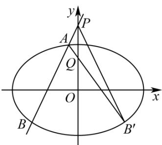

> [!faq]- 《第三章_圆锥曲线的方程_高效培优讲义_》官方解析
>
> > [!success]- **【答案】** (1) $\frac{x^2}{4} +\frac{y^2}{2} = 1$ (2)存在， $Q(0,1)$
>
> > [!note]- **【解析】**
> > （1）由题意得 $4a = 8$ ，则 $a = 2$ ，因为 $\frac{c}{a} = \frac{\sqrt{2}}{2}$ ，所以 $c = \sqrt{2}$
> >
> > 因为 $b^{2} = a^{2} - c^{2} = 2$ ，所以椭圆 $E$ 的方程为 $\frac{x^2}{4} +\frac{y^2}{2} = 1$
> >
> > (2) 存在；
> >
> > 当直线 $AB$ 的斜率不存在时， $A(0, \sqrt{2})$ ， $B(0, -\sqrt{2})$ ，设 $Q(0, t)$
> >
> > 因为 $\frac{|QA|}{|QB|} = \frac{|PA|}{|PB|}$ ，所以 $\frac{2 - \sqrt{2}}{2 + \sqrt{2}} = \frac{|t - \sqrt{2}|}{|t + \sqrt{2}|}$ ，从而 $\frac{2 - \sqrt{2}}{2 + \sqrt{2}} = \frac{t - \sqrt{2}}{t + \sqrt{2}}$ 或 $\frac{2 - \sqrt{2}}{2 + \sqrt{2}} = \frac{\sqrt{2} - t}{t + \sqrt{2}}$ ，
> >
> > 解得 $t = 2$ （舍去）或 $t = 1$ ，所以 $Q(0,1)$
> >
> > 当直线 AB 的斜率存在时，根据题意 k = 0 时，直线与椭圆无交点，不符合题意.
> >
> > 设 $A(x_{1},y_{1})$ ， $B(x_{2},y_{2})$ ，取点 B 关于 y 轴的对称点 $B'(-x_{2},y_{2})$
> >
> > 要使 $\frac{|PA|}{|PB|} = \frac{|x_1|}{|x_2|} = \frac{|QA|}{|QB'|}$ ，此时 $A, Q, B'$ 三点共线。设 $Q(0, t)$
> >
> > 设 $AB:y = kx + 2$ ，代入椭圆方程得 $\left(1 + 2k^2\right)x^2 +8kx + 4 = 0$
> >
> > 则 $x_{1} + x_{2} = \frac{-8k}{1 + 2k^{2}}$ ， $x_{1}x_{2} = \frac{4}{1 + 2k^{2}}$
> >
> > $$
> > k _ {A Q} - k _ {B ^ {\prime} Q} = \frac {y _ {1} - t}{x _ {1}} - \frac {y _ {2} - t}{- x _ {2}} = \frac {y _ {1} - t}{x _ {1}} + \frac {y _ {2} - t}{x _ {2}} = \frac {k x _ {1} + 2 - t}{x _ {1}} + \frac {k x _ {2} + 2 - t}{x _ {2}} = \frac {2 k x _ {1} x _ {2} + (2 - t) \left(x _ {1} + x _ {2}\right)}{x _ {1} x _ {2}}
> > $$
> >
> > $$
> > = 2 k + (2 - t) \frac {\left(x _ {1} + x _ {2}\right)}{x _ {1} x _ {2}} = 2 k + (2 - t) \times \frac {\frac {- 8 k}{1 + 2 k ^ {2}}}{\frac {4}{1 + 2 k ^ {2}}} = 2 k (1 - 2 + t) = 2 k (t - 1) = 0
> > $$
> >
> > 因为 $k \neq 0$ ，所以 $t = 1$ ，即点 $Q(0,1)$ 符合题意。
> >
> > 综上所述存在 $Q(0,1)$ ，使得 $\frac{|QA|}{|QB|} = \frac{|PA|}{|PB|}$
> >
> > 
