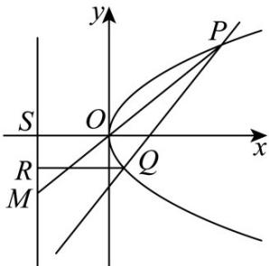

> [!faq]- 《第三章_圆锥曲线的方程_高效培优讲义_》官方解析
>
> > [!success]- **【答案】** (1) $y^{2}=2x$ (2) $\frac{|MS|}{|SR|}$ 为定值2.
>
> > [!note]- **【解析】**
> > （1）由已知得 $F\left(\frac{p}{2},0\right)$ ，则线段 $FF'$ 的中点为 $\left(\frac{p-2}{4},\frac{3}{4}\right)$
> >
> > 由题意得该中点在直线 l: $y = x + 1$ 上，
> >
> > 所以 $\frac{3}{4}=\frac{p-2}{4}+1$ ，解得p=1，
> >
> > 所以 C 的方程为 $y^{2}=2x$
> >
> > (2) 设直线 PQ 的方程为 $x = ty + 2$ ，且 $P(x_{1}, y_{1})$ ， $Q(x_{2}, y_{2})$
> >
> > 联立方程组 $\left\{ \begin{array}{l}x = ty + 2\\ y^2 = 2x \end{array} \right.$ ，整理得 $y^{2} - 2ty - 4 = 0$
> >
> > 可得 $\Delta = (-2t)^2 + 16 > 0$ ，且 $y_1 + y_2 = 2t$ ， $y_1y_2 = -4$ ，则 $ty_1y_2 = -2(y_1 + y_2)$
> >
> > 又直线 OP 的方程为 $y = \frac{y_{1}}{x_{1}} x$ ，令 x = -4，得点 M 的纵坐标 $y_{M} = \frac{-4y_{1}}{x_{1}}$
> >
> > 又点 Q 在 $l'$ 上的射影为 R，所以点 R 的纵坐标 $y_{R} = y_{2}$ . 则由图可得：
> >
> > $$
> > \frac {\left| M S \right|}{\left| S R \right|} = \frac {\left| y _ {M} \right|}{\left| y _ {R} \right|} = \frac {\left| y _ {M} \right|}{\left| y _ {2} \right|} = \frac {\left| 4 y _ {1} \right|}{\left| x _ {1} y _ {2} \right|} = \frac {\left| 4 y _ {1} \right|}{\left(t y _ {1} + 2\right) y _ {2}} = \frac {\left| 4 y _ {1} \right|}{\left| t y _ {1} y _ {2} + 2 y _ {2} \right|}
> > $$
> >
> > $$
> > = \frac {\left| 4 y _ {1} \right|}{\left| - 2 \left(y _ {1} + y _ {2}\right) + 2 y _ {2} \right|} = \frac {\left| 4 y _ {1} \right|}{\left| - 2 y _ {1} \right|} = 2
> > $$
> >
> > 所以 $\frac{|MS|}{|SR|}$ 为定值 2.
> >
> > 
