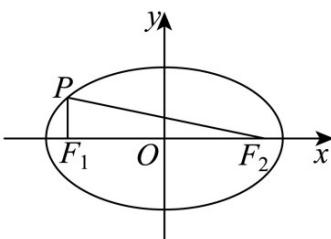

## 知识点 03 椭圆的焦点三角形

椭圆上的一点与两焦点所构成的三角形称为焦点三角形．解决焦点三角形问题常利用椭圆的定义和正弦定理、余弦定理．

以椭圆 $+ = 1(a > b > 0)$ 上一点 $P(x_0, y_0)(y_0 \neq 0)$ 和焦点 $F_1(-c, 0), F_2(c, 0)$ 为顶点的 $\triangle PF_1F_2$ 中，若 $\angle F_1PF_2 = \theta$ ，则

(1)椭圆的定义： $\left|PF_{1}\right|+\left|PF_{2}\right|=2a.$

(2)余弦定理： $4c^{2}=\left|PF_{1}\right|^{2}+\left|PF_{2}\right|^{2}-2\left|PF_{1}\right|\left|PF_{2}\right|\cdot\cos\theta.$

(3)面积公式： $S_{\triangle PF1F2} = |PF_1||PF_2|\cdot \sin \theta$ ，当 $\lfloor y_0\rfloor = b$ ，即 $P$ 为短轴端点时， $S_{\triangle PF1F2}$ 取最大值，为 $bc.$

重要结论： $S_{\triangle PF1F2}=b^{2}\tan\frac{\theta}{2}$

推导过程：由余弦定理得 $|\mathbf{F}_1\mathbf{F}_2|^2 = |PF_1|^2 + |PF_2|^2 - 2|PF_1||PF_2| \cdot \cos \theta$ 得

$$
4 c ^ {2} = \left(\left| P F _ {1} \right| + \left| P F _ {2} \right|\right) ^ {2} - 2 \left| P F _ {1} \right\lvert \left| P F _ {2} \right| (1 + \cos \theta)
$$

$$
4 c ^ {2} = 4 a ^ {2} - 2 \left| P F _ {1} \right\lVert P F _ {2} \left| (1 + \cos \theta) \right.
$$

$$
\left| P F _ {1} \right| \left| P F _ {2} \right| = \frac {2 b ^ {2}}{1 + \cos \theta}
$$

由三角形的面积公式可得

$$
S _ {\triangle P F 1 F 2} = \frac {1}{2} \left| \mathrm{PF} _ {1} \right| \left| \mathrm{PF} _ {2} \right| \sin \theta = \frac {1}{2} \cdot \frac {2 b ^ {2}}{1 + \cos \theta} \cdot \sin \theta = b ^ {2} \frac {\sin \theta}{1 + \cos \theta} = b ^ {2} \frac {2 \sin \frac {\theta}{2} \cos \frac {\theta}{2}}{2 \cos^ {2} \frac {\theta}{2}} = b ^ {2} \tan \theta
$$

注： $S_{\triangle PF1F2}=b^{2}\tan\frac{\theta}{2}=c\left|y_{p}\right|=(a+c)r$ （r是三角形内切圆的半径）

(4)焦点三角形的周长为 $2(a + c)$ .

(5)在椭圆 $\mathbf{C}: + = 1(a > b > 0)$ 中， $F_{1}$ ， $F_{2}$ 是椭圆的两个焦点， $\mathbf{P}$ 是椭圆上任意的一点，当点 $\mathbf{P}$ 在短轴端点时， $\angle F_{1}PF_{2}$ 最大.

【即学即练】

1．椭圆 $C:\frac{x^{2}}{16}+\frac{y^{2}}{25}=1$ 的两个焦点为 $F_{1}$ ， $F_{2}$ ，椭圆 C 上有一点 P，则 $\triangle PF_{1}F_{2}$ 的周长为（）

A.12 B.18 C.16 D.20

【答案】C

【详解】因为 $a = 5$ ， $b = 4$ ，所以 $c = \sqrt{a^2 - b^2} = 3$ ，故 $\triangle PF_1F_2$ 的周长为 $2a + 2c = 16$

故选：C

2. 已知 $F_{1}, F_{2}$ 分别是椭圆 $C: \frac{x^{2}}{9} + \frac{y^{2}}{3} = 1$ 的左、右焦点，点 $P$ 在 $C$ 上， $\angle PF_{1}F_{2} = 90^{\circ}$ ，则 $\triangle PF_{1}F_{2}$ 的面积为（）A. $\sqrt{6}$ B. $2\sqrt{2}$ C. $2\sqrt{6}$ D. $4\sqrt{2}$

【答案】A

【详解】在椭圆 $C:\frac{x^{2}}{9}+\frac{y^{2}}{3}=1$ 中， $a=3,\quad b=\sqrt{3},\quad c=\sqrt{a^{2}-b^{2}}=\sqrt{6}$ ，
则 $\left|F_{1}F_{2}\right|=2\sqrt{6}$ 点 P 在 C 上， $\angle PF_{1}F_{2}=90^{\circ}$ ，所以 $\left|y_{P}\right|=1$ 则 $S_{\triangle PF_{1}F_{2}}=\frac{1}{2}\left|F_{1}F_{2}\right|\cdot\left|y_{P}\right|=\sqrt{6}$

故选：A

